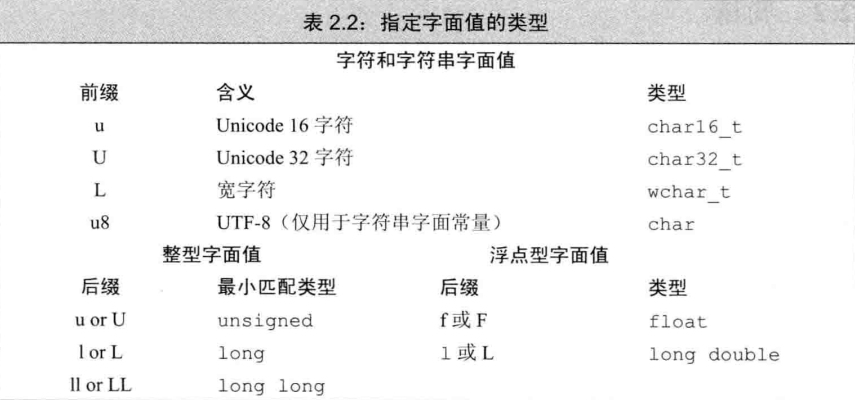

## 第一章 开始

### 1.2 输入输出

`std::cout`是输出流，`std::cin`是输入流。
`cin >> x;` 读取输入并存入x中，`>>` 是输入运算符，`<<` 是输出运算符。
连续输入时，可以使用空格、制表符、回车键来分隔输入的数据。
example:

```cpp
int a, b;
std::cin >> a >> b;
std::cout << a + b << std::endl;
```

输出时，使用`std::endl`, `std::endl`是输出运算符，输出一个换行符，并且刷新缓冲区。

### 1.5 类简介

`#include` 指令，如果是包含来自标准库的头文件时，使用尖括号`<>`，如果是不属于标准库的头文件，使用双引号`""`。

## 第二章 变量和基本类型

### 2.1 基本内置类型

> 常见类型及大小:
> char 8 bits, short 16 bits, int 16/32 bits(取决于系统, 16位系统为16位, 32位系统为32位),
> long 32 bits, long long 64 bits,
> float 32 bits, double 64 bits, long double 80 bits.

1. 无符号类型的使用：当明确知晓数值不可能为负时，选用无符号类型。
2. 整数类型的选择：
   - 使用 int 执行整数运算。在实际应用中, short 常常显得太小，而 long 一般和 int 有一样的尺寸。
    > 在早期的一些系统中，long 通常是 32 位，int 是 16 位，这符合当时硬件和软件的设计情况。但随着计算机硬件的发展，尤其是 32 位和 64 位系统的普及，为了提高运算效率和数据处理的一致性，很多现代编译器和系统将 long 的尺寸调整为与 int 相同，一般都是 32 位或者 64 位（具体取决于操作系统和编译器的设置）。这样做的好处是，在进行整数运算时可以减少数据类型转换带来的开销，并且在一些算法和数据结构中，使用 long 和 int 可以更加灵活且不需要担心尺寸差异带来的问题。同时，也简化了程序员对整数类型的选择和使用，因为在很多情况下，不需要特别区分 long 和 int，直接使用 int 就能满足大部分整数运算的需求，只有在数据范围超过 int 时，才考虑使用 long long。
   - 如果你的数值超过了 int 的表示范围，选用 long long。
    > int 范围：-32768 ~ 32767
3. 字符与布尔类型的使用：在算术表达式中不要使用 char 或 bool, 只有在存放字符或布尔值时才使用它们。因为 char 类型在一些机器上是有符号的，而在另一些机器上又是无符号的，所以如果使用 char 进行运算特别容易出问题。如果你需要使用一个不大的整数，那么明确指定它的类型是 signed char 或者 unsigned char。
4. 浮点数类型的选择：执行浮点数运算选用 double。这是因为 float 通常精度不够, 而且双精度浮点数和单精度浮点数的计算代价相差无几。事实上, 对于某些机器来说, 双精度运算甚至比单精度还快。long double 提供的精度在一般情况下是没有必要的，况且它带来的运行时消耗也不容忽视。

当我们赋给无符号类型一个超出它表示范围的值时, 结果是初如给值对无符号类型表示数值总数取模后的余数。例如, 8比特大小的unsigned char可以表示0至255区间内的值, 如果我们赋了一个区间以外的值, 则实际的结果是该值对256取模后所得的余数。因此, 把-1赋给8比特大小的unsigned char所得的结果是255。

### 2.2 指定字面值的类型

如果反斜线 \ 后面跟着的八进制数字超过 3 个，只有前 3 个数字与 \ 构成转义序列。
例如，"\1234" 表示 2 个字符，即八进制数 123 对应的字符以人及字符 4。相反，\x 要用到后面跟着的所有数字，例如，"\x1234" 表示一个 16 位的字符，该字符由这 4 个十六进制数所对应的特唯一确定。



**'a'**：字符型（char），表示一个普通的字符常量。
**"a"**：字符串型（char []），是一个包含字符a和字符串结束标志\0的字符数组。

以 0 开头的整数（如 09）是八进制数，而八进制数中不会出现数字 8 和 9，所以int month = 09, day = 07;这种写法是错误的，会导致编译错误。

#### 变量的定义和声明次数

解释：一个变量在整个程序中只能有一个定义，因为变量在内存中只能有一个实际的存储位置来保存其值。但可以在多个地方对其进行声明，以便在不同的代码区域都能知道该变量的存在和相关信息，方便使用。
例子：
假设在file1.cpp中有int global_var = 5;（这是global_var的定义）。
在file2.cpp中如果要使用global_var，可以写extern int global_var;（这是对global_var的声明，告诉编译器这个变量在其他地方已经定义了），但不能再写int global_var = 10;，否则会报错，因为重复定义了global_var。

### 2.3 指针

#### 在 C++ 中，int \*p = ival这种写法是错误的

原因如下：
int \*p表示p是一个指向int类型的指针，指针需要存储的是一个地址值。
ival是一个int类型的变量，它的值是42（在这个例子中），而不是一个地址。
而&ival是获取ival这个变量的地址，所以int \*p = &ival才是正确的，这样p就指向了ival的地址，后续可以通过\*p来操作ival所代表的内存区域中的值。
例如，如果之后执行\*p = 100，那么ival的值就会变为100，因为p指向了ival的地址，通过*p就可以修改ival的值。

```cpp
  // 定义一个 double 类型的变量 dval
  double dval;
  // 定义一个指向 double 类型的指针 pd，并将 dval 的地址赋给 pd，这是正确的，因为初始值是 double 型对象的地址
  double *pd = &dval;
  // 定义另一个指向 double 类型的指针 pd2，并将 pd 的值赋给 pd2，这是正确的，因为 pd 和 pd2 都是指向 double 类型的指针
  double *pd2 = pd; 
  
  // 定义一个指向 int 类型的指针 pi，下面这行代码是错误的，因为指针 pi 的类型和 pd 的类型不匹配
  int *pi = pd; 
  // 下面这行代码也是错误的，因为试图把 double 型对象的地址赋给 int 型指针
  pi = &dval; 
```

### 利用指针访问对象

- 如果指针指向了一个对象，则允许使用解引用符（操作符*）来访问该对象：
  - `int ival = 42;`
  - `int *p = &ival; // p存放着变量ival的地址，或者说p是指向变量ival的指针`
  - `cout << *p; // 由符号*得到指针p所指的对象，输出42`
- 对指针解引用会得出所指的对象，因此如果给解引用的结果赋值，实际上也就是给指针所指的对象赋值：
  - `*p = 0; // 由符号*得到指针p所指的对象，即可经由p为变量ival赋值`
  - `cout << *p; // 输出0`
- 如上述程序所示，为*p赋值实际上是为p所指的对象赋值。
  
```cpp
int i = 42;
int &r = i; // &紧随类型名出现, 因此是声明的一部分, r是一个引用
int *p; // *紧随类型名出现, 因此是声明的一部分, p是一个指针
p = &i; // &出现在表达式中, 是一个取地址符
*p = i; // *出现在表达式中, 是一个解引用符
int &r2 = *p; // &是声明的一部分, *是一个解引用符
```

#### 建议：初始化所有指针

> 在新标准下，现在的C++程序最好使用nullptr，同时尽量避免使用NULL。
> 建议:初始化所有指针使用未经初始化的指针是引发运行时错误的一大原因。
> 和其他变量一样,访问未经初始化的指针所引发的后果也是无法预计的。通常这一行为将造成程序崩溃,而且一旦崩溃,要想定位到出错位置将是特别棘手的问题。
> 在大多数编译器环境下, 如果使用了未经初始化的指针, 则该指针所占内存空间的当前内容将被看作一个地址值。访问该指针, 相当于去访问一个本不存在的位置上的本不存在的对象。糟糕的是, 如果指针所占内存空间中恰好有内容, 而这些内容又被当作了某个地址, 我们就很难分清它到底是合法的还是非法的了。
> 因此建议初始化所有的指针, 并且在可能的情况下, 尽量等定义了对象之后再定义指向它的指针。如果实在不清楚指针应该指向何处, 就把它初始化为nullptr或者0, 这样程序就能检测并知道它没有指向任何具体的对象了。

#### const

> `const`变量是只读的，不能被修改。

某些时候有这样一种`const`变量，它的初始值不是一个常量表达式，但又确实有必要在文件间共享。这种情况下，我们不希望编译器为每个文件分别生成独立的变量。相反，我们想让这类`const`对象像其他（非常量）对象一样工作，也就是说，只在一个文件中定义`const`，而在其他多个文件中声明并使用它。

解决的办法是，对于`const`变量不管是声明还是定义都添加`extern`关键字，这样只需定义一次就可以了：

```cpp
// file_l.cc定义并初始化了一个常量,该常量能被其他文件访问
extern const int bufSize = fcn();
// file1.h头文件
extern const int bufSize; // 与file 1.cc定义的bufSize是同一个
```

如上述程序所示，`filel.cc`定义并初始化了`bufsize`。因为这条语句包含了初始值，所以它（显然）是一次定义。然而，因为`bufSize`是一个常量，必须用`extern`加以限定使其被其他文件使用。
`filel.h`头文件中的声明也由`extern`做了限定，其作用是指明`bufSize`并非本文件所独有，它的定义将在别处出现。
如果想在多个文件之间共享`const`对象，必须在变量的定义之前添加`extern`关键字。

#### 顶层const、底层const

1. **指针作为对象及指向对象的概念阐释**
    - 指针本质上是一种变量，在内存中占据特定的存储空间。如同其他常规变量，指针能够存储一个值，而该值为另一个对象（诸如变量、数组元素等）的内存地址。举例而言，若存在一个 `int` 类型变量 `a = 5`，可通过定义 `int *p = &a;` 使指针 `p` 指向变量 `a`。在此情形下，`p` 即为指针对象，其存储的是变量 `a` 的地址。
    - 指针作为对象，具备可修改性。以前述例子为基础，假设有另一个 `int` 类型变量 `b = 10`，执行 `p = &b` 操作后，指针 `p` 便不再指向变量 `a`，而是转而指向变量 `b`。

2. **顶层 const（top - level const）的内涵**
    - 当指针自身成为常量时，便涉及顶层 `const` 概念。例如 `int *const p = &a;`，此处的 `const` 修饰的是指针 `p` 本身。这表明指针 `p` 所存储的地址值不可更改，即指针 `p` 被 “固定” 在初始指向的地址上。
    - 以形象的类比来说，若将指针视作一把钥匙，那么顶层 `const` 就如同把这把钥匙固定在了特定的锁孔（初始指向的地址），无法将其拔出并插入其他锁孔。

3. **底层 const（low - level const）的内涵**
    - 当指针所指向的对象为常量时，即属于底层 `const` 情况。例如 `const int *p = &a;`，这里的 `const` 修饰的是 `*p`，也就是指针所指向的对象。这意味着通过指针 `p` 无法修改其所指向对象的值。
    - 延续钥匙与锁的类比，指针依旧为钥匙，而底层 `const` 则是将锁设置为只读模式。钥匙能够插入不同的只读锁（即指针可指向其他常量对象），但无法利用这把钥匙改变锁内的内容（即无法通过指针修改所指常量对象的值）。

4. **顶层 const 与底层 const 相互独立的缘由**
    - 指针可仅带有顶层 `const`，例如 `int *const p = &a;`，此时指针本身的指向不可改变，但可通过指针 `p` 修改其所指向对象 `a` 的值。
    - 指针也可仅带有底层 `const`，例如 `const int *p = &a;`，此时指针能够改变指向（只要是指向 `const int` 类型的对象），然而不能通过指针 `p` 修改其所指向对象的值。
    - 指针还可能同时具备顶层 `const` 和底层 `const`，例如 `const int *const p = &a;`，在此情形下，指针本身既无法改变指向，也不能通过指针 `p` 修改其所指向对象的值。由此可见，指针本身是否为常量以及指针所指向的对象是否为常量，是两个相互独立的属性，它们能够组合出多种不同的情况。 

#### size_type

由于`size`函数返回的是一个无符号整型数，因此切记，如果在表达式中混用了带符号数和无符号数，将可能产生意想不到的结果。

例如，假设`n`是一个具有负值的`int`，则表达式`s.size() < n`的判断结果几乎肯定是`true`。这是因为负值`n`会自动地转换成一个比较大的无符号值。

**Tips:** 如果一条表达式中已经有了`size()`函数，就不要再使用`int`了，这样可以避免混用`int`和`unsigned`可能带来的问题。

**Tips:** 注意检查下标的合法性。
使用下标时必须确保其在合理范围之内，也就是说，下标必须大于等于0而小于字符串的`size()`的值。一种简便易行的方法是，总是设下标的类型为`string::size_type`，因为此类型是无符号数，可以确保下标不会小于0。此时，代码只需保证下标小于`size()`的值就可以了。

> C++标准并不要求标准库检测下标是否合法。一旦使用了一个超出范围的下标，就会产生不可预知的结果。

## 第三章 字符串、向量和数组

### 3.2 string

当把`string`对象和字符字面值及字符串字面值混在一条语句中使用时，必须确保每个加法运算符（`+`）的两侧的运算对象至少有一个是`string`：

```cpp
string s4 = s1 + 'a'; // 正确：把一个`string`对象和一个字面值相加
string s5 = "hello" + 'a'; // 错误：两个运算对象都不是`string`
string s6 = s1 + ", " + "world"; // 正确：每个加法运算符都有一个运算对象是`string`
string s7 = "hello" + ", " + s2; // 错误: 不能将字面值直接相加
```

> 因为某些历史原因,也为了与C兼容,所以C++语言中的的字符串字面值并不是标准库类型string的对象。切记,字符串字面值与string是不同的类型

### 3.3 vector

某些编译器可能仍然需要以老式的声明语句来处理元素为`vector`的`vector`对象，如`vector<vector<int> >`注意外层`vector`对象的右尖括号和其元素类型之间添加一个空格

```cpp
// v1 有 10 个元素，每个的值都是 0
vector<int> v1(10); 
// v2 有 1 个元素，该元素的值是 10
vector<int> v2{10}; 
// v3 有 10 个元素，每个的值都是 1
vector<int> v3(10, 1); 
// v4 有 2 个元素，值分别是 10 和 1
vector<int> v4{10, 1}; 
```

如果用的是圆括号，可以说提供的值是用来构造（construct）`vector` 对象的。例如，`v1` 的初始值说明了 `vector` 对象的容量；`v3` 的两个初始值则分别说明了 `vector` 对象的容量和元素的初值。

如果用的是花括号，可以表述成我们想列表初始化（list initialize）该 `vector` 对象。也就是说，初始化过程会尽可能地把花括号内的值当成是元素初始值的列表来处理，只有在无法执行列表初始化时才会考虑其他初始化方式。在上例中，给 `v2` 和 `v4` 提供的初始值都能作为元素的值，所以它们都会执行列表初始化，`vector` 对象 `v2` 包含一个元素而 `vector` 对象 `v4` 包含两个元素。 

**提示：只能对确知已存在的元素执行下标操作！**

关于下标必须明确的一点是：只能对确知已存在的元素执行下标操作。例如：

```cpp
vector<int> ivec; // 空 vector 对象
cout << ivec[0]; // 错误：ivec 不包含任何元素
vector<int> ivec2(10); // 含有 10 个元素的 vector 对象
cout << ivec2[10]; // 错误：ivec2 元素的合法索引是从 0 到 9
```

试图用下标的形式去访问一个不存在的元素将引发错误，不过这种错误不会被编译器发现，而是在运行时产生一个不可预知的值。

不幸的是，这种通过下标访问不存在的元素的行为非常常见，而且会产生很严重的后果。所谓的缓冲区溢出（buffer overflow）指的就是这类错误，这也是导致 PC 及其他设备上应用程序出现安全问题的一个重要原因。

**Tip**：确保下标合法的一种有效手段就是尽可能使用范围 for 语句。

### 3.4 迭代器介绍

所有标准库容器都可以使用迭代器，但是只有其中少数几种才能同时支持下标运算符。严格来说，string对象不属于容器类型，但是string支持很多与容器类型类似的操作。

### 3.5 数组

字符数组有一种额外的初始化形式，我们可以用字符串串字面值对此类数组初始化。当使用这种方式时，一定要注意字符串字面值的结尾处还有一个空字符，这个空字符也会像字符串的其他字符一样被拷贝到字符数组中去。

```cpp
char a1[] = {'C', '+', '+'}; // 列表初始化，没有空字符
char a2[] = {'C', '+', '+', '\0'}; // 列表初始化，含有显式的空字符
char a3[] = "C++"; // 自动添加表示字符串结束的空字符
// const char a4[6] = "Daniel"; // 错误：没有空间可存放空字符！
```

#### 不允许拷贝和赋值

不能将数组的内容拷贝给其他数组作为其初始值，也不能用数组为其他数组赋值：

```c
int a[] = {0, 1, 2}; // 含有3个整数的数组
int a2[] = a; // 错误：不允许使用一个数组初始化另一个数组
a2 = a; // 错误：不能把一个数组直接赋值给另一个数组
```

**警告**：一些编译器支持数组的赋值，这就是所谓的编译器扩展（compiler extension）。但一般来说，最好避免使用非标准特性，因为含有非标准特性的程序很可能在其他编译器上无法正常工作。

#### 指针和数组

在 C++ 语言中，指针和数组有非常紧密的联系。就如即将介绍的，使用数组的时候编译器一般会把它转换成指针。

通常情况下，使用取地址符（参见 2.3.2 节，第 47 页）来获取指向某个对象的指针，取地址符可以用于任何对象。数组的元素也是对象，对数组使用下标运算符得到该数组指定位置的元素。因此像其他对象一样，对数组的元素使用取地址符就能得到指向该元素的指针。

```cpp
string nums[] = {"one", "two", "three"}; // 数组的元素是 string 对象
string *p = &nums[0]; // p 指向 nums 的第一个元素
```

然而，数组还有一个特性：**在很多用到数组名字的地方，编译器都会自动地将其替换为一个指向数组首元素的指针**：

```cpp
string *p2 = nums; // 等价于 p2 = &nums[0]
```

> 在大多数表达式中，使用数组类型的对象其实是使用一个指向该数组首元素的指针。

由上可知，在一些情况下数组的操作实际上是指针的操作，这一结论有很多隐含的意思。其中一层意思是当使用数组作为一个 auto（参见 2.5.2 节，第 61 页）变量的初始值时，推断得到的类型是指针而非数组：

```cpp
int ia[] = {0,1,2,3,4,5,6,7,8,9}; // ia 是一个含有 10 个整数的数组
auto ia2(ia); // ia2 是一个整型指针，指向 ia 的第一个元素
ia2 = 42; // 错误：ia2 是一个指针，不能用 int 值给指针赋值
```

尽管 ia 是由 10 个整数构成的数组，但当使用 ia 作为初始值时，编译器实际执行的初始化过程类似于下面的形式：

```cpp
auto ia2(&ia[0]); // 显然 ia2 的类型是 int*
```

必须指出的是，当使用 decltype 关键字（参见 2.5.3 节，第 62 页）时上述转换不会发生，decltype(ia) 返回的类型是由 10 个整数构成的数组：

```cpp
// ia3 是一个含有 10 个整数的数组
decltype(ia) ia3 = {0,1,2,3,4,5,6,7,8,9};
ia3 = p; // 错误：不能用整型指针给数组赋值
*ia3 = i; // 正确：把 i 的值赋给 ia3 的一个元素
``` 

### 3.6 多维数组

程序使用多维数组的名字时，也会自动将其转为指向数组首元素的指针

## 第四章 表达式

### 基础

#### 左值和右值

C++ 的表达式要么是右值（rvalue，读作 “are - value”），要么就是左值（lvalue，读作 “ell - value”）。这两个名词是从 C 语言继承过来的，原本是为了帮助记忆：左值可以位于赋值语句的左侧，右值则不能。

在 C++ 语言中，二者的区别就没那么简单了。一个左值表达式的求值结果是一个对象或者一个函数，然而以常量对象为代表的某些左值实际上不能作为赋值语句的左侧运算对象。此外，虽然某些表达式的求值结果是对象，但它们是右值而非左值。可以做一个简单的归纳：当一个对象被用作右值的时候，用的是对象的值（内容）；当对象被用作左值的时候，用的是对象的身份（在内存中的位置）。

不同的运算符对运算对象的要求各不相同，有的需要左值运算对象、有的需要右值运算对象；返回值也有差异，有的得到左值结果、有的得到右值结果。一个重要的原则（参见 13.6 节，第 470 页将介绍一种例外的情况）是在需要右值的地方可以用左值来代替，但是不能把右值当成左值（也就是位置）使用。当一个左值被当成右值使用时，实际使用的是它的内容（值）。到目前为止，已经有几种我们熟悉的运算符是要用到左值的。

- 赋值运算符需要一个（非常量）左值作为其左侧运算对象，得到的结果也仍然是一个左值。
- 取地址符（参见 2.3.2 节，第 47 页）作用于一个左值运算对象，返回一个指向该运算对象的指针，这个指针是一个右值。
- 内置解引用运算符、下标运算符（参见 2.3.2 节，第 48 页；参见 3.5.2 节，第 104 页）、迭代器解引用运算符、string 和 vector 的下标运算符（参见 3.4.1 节，第 95 页；参见 3.2.3 节，第 83 页；参见 3.3.3 节，第 91 页）的求值结果都是左值。
- 内置类型和迭代器的递增递减运算符（参见 1.4.1 节，第 11 页；参见 3.4.1 节，第 96 页）作用于左值运算对象，其前置版本（本书之前章节所用的形式）所得的结果也是左值。

接下来在介绍运算符的时候，我们将会注明该运算符的运算对象是否必须是左值以及其求值结果是否是左值。

使用关键字 decltype（参见 2.5.3 节，第 62 页）的时候，左值和右值也有所不同。如果表达式的求值结果是左值，decltype 作用于该表达式（不是变量）得到一个引用类型。举个例子，假定 p 的类型是 int*，因为解引用运算符生成左值，所以 decltype(*p) 的结果是 int&。另一方面，因为取地址运算符生成右值，所以 decltype(&p) 的结果是 int**，也就是说，结果是一个指向整型指针的指针。 

### 递增和递减运算符

### 后置递增运算符与解引用运算符的运算规则解释

后置递增运算符的优先级高于解引用运算符，因此表达式 `*pbeg++` 等价于 `*(pbeg++)`。

在 `pbeg++` 这个操作中：

- 首先，`pbeg++` 会把 `pbeg` 的值加 `1`。
- 然后，返回 `pbeg` 的初始值的副本作为其求值结果。

此时，解引用运算符 `*` 的运算对象是 `pbeg` 未增加之前的值。

最终，这条语句达成了两个效果：

- 输出 `pbeg` 开始时指向的那个元素。
- 并将指针 `pbeg` 向前移动一个位置。

因为`pbeg++`就是先返回一个`pbeg`的副本，再将`pbeg`加 1，注意与`++pbeg`的区别，`++pbeg`是加完后返回+1后的副本

### 成员访问运算符

点运算符（参见1.5.2节，第21页）和箭头运算符（参见3.4.1节，第98页）都可用于访问成员，其中，点运算符获取类对象的一个成员；箭头运算符与点运算符有关，表达式`ptr->mem`等价于`(*ptr).mem`。

```cpp
string s1 = "a string";
auto* p = &s1;
auto n = s1.size(); // 运行string对象s1的size成员
n = (*p).size(); // 运行p所指对象的size成员
n = p->size(); // 等价于(*p).size()
```

因为解引用运算符的优先级低于点运算符，所以执行解引用运算的子表达式两端必须加上括号。如果没加括号，代码的含义就大不相同了：

```cpp
// 运行p的size成员，然后解引用size的结果
*p.size(); // 错误：p是一个指针，它没有名为size的成员
```

这条表达式试图访问对象p的size成员，但是p本身是一个指针且不包含任何成员，所以上述语句无法通过编译。

箭头运算符作用于一个指针类型的运算对象，结果是一个左值。点运算符分成两种情况：如果成员所属的对象是左值，那么结果是左值；反之，如果成员所属的对象是右值，那么结果是右值。

### sizeof运算符

- `sizeof`满足右结合律且与`*`运算符优先级一样，表达式如`sizeof *p`等价于`sizeof(*p)`。
- `sizeof`不会实际运算对象的值，对无效（未初始化）指针运算也无影响，解引用无效指针是安全行为，因指针实际未被真正使用。
- C++11新标准允许使用作用域运算符获取类成员的大小。通常需通过类的对象访问类成员，但`sizeof`运算符无须提供具体对象，想知道类成员大小无须真的获取该成员。
- `sizeof`运算符的结果部分依赖于其作用的类型：
  - 对`char`或类型为`char`的表达式执行`sizeof`，结果为1。
  - 对引用类型执行`sizeof`得到被引用对象所占空间大小。
  - 对指针执行`sizeof`得到指针本身所占空间大小。
  - 对解引用指针执行`sizeof`得到指针指向对象所占空间大小，指针无需有效。
  - 对数组执行`sizeof`得到整个数组所占空间大小，等价于对数组中所有元素各执行一次`sizeof`并求和，且`sizeof`不会把数组转换成指针处理。
  - 对`string`对象或`vector`对象执行`sizeof`只返回该类型固定部分的大小，不会计算对象中元素占用空间。 

### 类型转换

#### reinterpret_cast

`reinterpret_cast` 是 C++ 中的强制类型转换运算符，用于对运算对象的位模式进行低层次重新解释。

**示例代码**：

```cpp
int* ip;
char* pc = reinterpret_cast<char*>(ip);
```

此代码将 `int` 类型指针 `ip` 强制转换为 `char` 类型指针 `pc`。

**风险说明**：
`pc` 实际指向的是 `int` 对象，若当普通字符指针使用，可能运行时出错。如：

```cpp
string str(pc);
```

该代码可能引发异常运行时行为。
使用 `reinterpret_cast` 很危险，类型改变但编译器无提示。用 `int` 地址初始化 `pc` 时，编译器认可转换，后续用 `pc` 时认定其为 `char*` 类型，不知其实际指向 `int` 指针。用 `pc` 初始化 `str` 语法正确但可能有严重后果，且问题原因难查，若相关语句在不同文件中情况更甚。

**注意事项**：
`reinterpret_cast` 本质依赖机器，安全使用需熟知涉及类型和编译器转换过程。

#### 显式转换

C++ 编程中，有时需显式将对象强制转换为其他类型。

**示例场景**：

```cpp
int i, j;
double slope = i / j;
```

若要正确执行浮点数除法，需将 `i` 和 / 或 `j` 显式转换为 `double` 类型，此即强制类型转换（cast）。

**风险提示**：
强制类型转换虽有时必要，但本质危险，可能导致数据丢失、精度降低或产生未定义行为等问题。

**命名的强制类型转换**：
形式为 `cast - name<type>(expression);` ，其中：

- `type`：转换目标类型。
- `expression`：要转换的值。
- 若 `type` 为引用类型，结果为左值。
- `cast - name` 包含 `static_cast`、`dynamic_cast`、`const_cast` 和 `reinterpret_cast` 等。不同 `cast - name` 适用于不同场景，语义和限制条件各异。如 `static_cast` 用于较安全类型转换，像基本数据类型转换、有继承关系类型的上行转换等；`dynamic_cast` 主要用于有继承关系类对象的下行转换，且进行运行时类型检查；`const_cast` 主要用于添加或移除 `const` 属性。 

## 第5章 语句

### 5.1 简单语句
### 5.2 语句作用域
### 5.3 条件语句
#### 5.3.1 if语句
#### 5.3.2 switch语句
### 5.4 迭代语句
#### 5.4.1 while语句
#### 5.4.2 传统的for语句
#### 5.4.3 范围for语句
#### 5.4.4 do while语句
### 5.5 跳转语句
#### 5.5.1 break语句
break语句（break statement）负责终止离它最近的while、do while、for或switch语句，并从这些语句之后的第一条语句开始继续执行。 
#### 5.5.2 continue语句
continue语句（continue statement）终止最近循环中的当前迭代并立即开始下一次迭代。它只能出现在for、while和do while循环内部，或嵌套在这类循环里的语句或块内部。在嵌套循环中，continue语句仅作用于离它最近的循环。与break语句不同，只有当switch语句嵌套在迭代语句内部时，才能在switch里使用continue。 
#### 5.5.3 goto语句
goto语句（goto statement）是C++语言中唯一的无条件跳转语句。它的作用是将控制权转移到程序中指定的标签处。
不要用，他使得程序既难以阅读又难以维护。

### 5.6 TRY语句块和异常处理
#### 5.6.1 throw表达式
#### 5.6.2 try语句块
#### 5.6.3 标准异常 

## 第六章 函数

## 第七章 类

