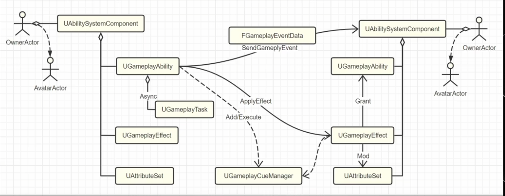
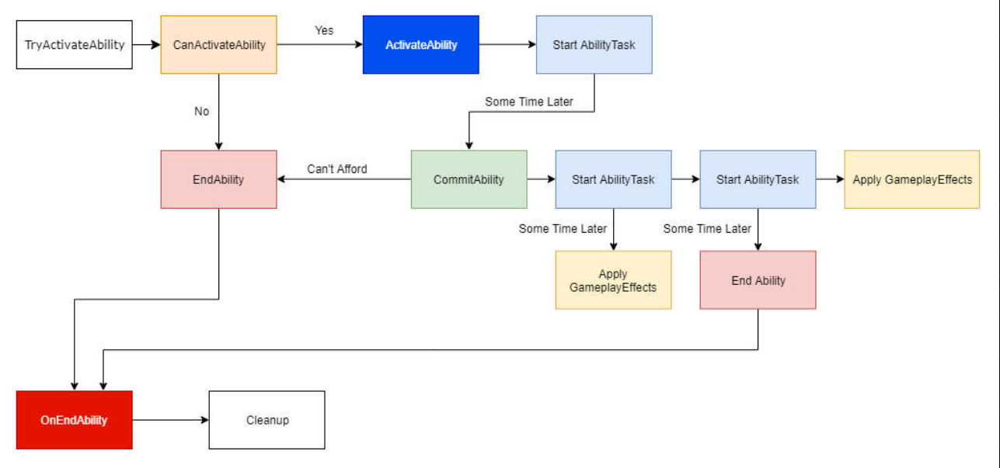

## GAS 初探

### GAS 调研

> GAS 学习成本是否超过收益？
> GAS 主要还是用于大型联机项目的技能系统，与当前项目并不是很匹配，但是设计思想是非常好的。如果自己重新按照设计思想去设计一个框架，对比起 GAS 以及后续可能出现的需求，是否具有更好的性价比呢？

为什么要用 GAS？

- 可以实现带有消耗和冷却功能的技能
- 处理数值属性（等级、攻击力、防御力）
- 应用状态效果（烟花、眩晕）
- 应用游戏标签（GameplayTags 管理）
- 特效和音效
- 网络复制和预测

适合用 GAS 的项目

- C++ 项目，对 GAS 有足够的了解，多读源码
- 使用 Dedicated Server 的，或者之前没有自己做服务器框架，局域网联机也能用的
- 有复杂的技能逻辑设计需求

> The plugin provides an out-of-the-box solution in single and multiplayer games for:
>
> - Implementing level-based character abilities or skills with optional costs and cooldowns (GameplayAbilities)
> - Manipulating numerical Attributes belonging to actors (Attributes)
> - Applying status effects to actors (GameplayEffects)
> - Applying GameplayTags to actors (GameplayTags)
> - Spawning visual or sound effects (GameplayCues)
> - Replication of everything mentioned above

**先读代码、再做开发。**

个人经验：框架灵活度越高，设计耗费的精力越多越复杂；灵活性低的就是逻辑开发了，需要再次解耦

---

GAS 中各模块个人理解：

- UAbilitySystemComponent - ASC
- UGameplayAbility - GA，角色可以执行的事情都能用 GA，移动和 UI 不要用 GA
- FGameplayAttribute - Attribute，一般会设置当前等级、最高等级，然后添加宏定义，就能满足各种需求了，实际上是在 ASC init 时加载父类的时候会判断是否存在 AttributeSet
- FGameplayTag - Tag， 还是像管理用的，方便做树状图
- UGameplayEffect - GE，做所有的数值结算，对自己或他人产生影响，可以根据 GameplayTags 去配置触发哪个技能，阻塞哪些技能，这些技能可能就是一个操作，挥个拳之类的。GE 本身也有等级，我们可以根据 CurveTable 去配置不同等级触发的效果
- UGameplayTask - Task 异步操作, eg: 技能里播放一个蒙太奇，结束后再结束该技能
- UGameplayCueNotify - GC
- FGameplayEventData - Event
- Who:谁能放技能？AbilitySystemComponent，只有挂载 ASC 模块的 Actor 才能放技能，一般联机或者死亡要保留数据的就把他挂载在 PlayerState
- How:技能的逻辑？GameplayAbility，编写技能逻辑
- Change:技能的效果？GameplayEffect，技能效果、改变了什么
- What:技能改变的属性？GamePlayAttribute，属性设置
- If:技能涉及的条件？GameplayTag，组合查询
- Visual:技能的视效？GameplayCue，看起来是什么样
- Async:技能的长时行动？GameplayTask
- Send:技能消息事件？GamePlayEvent，技能之间互相发送

---

Actor 通信的一种方式



技能触发执行流程



---

### GAS 简易流程

#### Gameplay Abilities

1. 为角色添加 AbilitySystem
2. 创建 GA 蓝图，继承自 Gameplay Ability，在里面实现能力
   1. Event ActivateAbility，激活时就会触发
   2. GA 里获得 character 用 Get Avatar Actor from Actor Info
   3. 最后别忘了 End Ability
3. 角色蓝图中，别忘了 Give Ability
   1. 用添加的 AbilitySystem，调用 Give Ability 节点，激活对应的 Ability Class/xx/xx
4. 在该实现功能的地方，调用 Try Activate Ability/ by Class/ by Tag
   1. 使用 Get player character 去调用 Get Ability System Component（因为挂载到了角色身上）

#### Gameplay Tags

1. 先去 Project Settings->Project->GameplayTags->Manage Gameplay Tags 新建 tag
2. 打开 GA 蓝图，查看 Class Default(Stimulation，运行按钮边上)，可以看到 Tags 列表
3. Ability Tags 是添加的标签，其他的是标签 Rules，最简单操作就是只添加一个标签
4. 激活能力的地方改为 Try Activate Abilities by Tag（最推荐的方法），传入 tag 就用 Make Literal Gameplay Tag Container

#### Gameplay Effects

> They can modify attributes grant, activate abilities, add or remove gameplay tags

1. 先去创建一个 Tag
2. 创建新蓝图，继承自 Gameplay Effect
3. 配置效果 Details 面板，以着火为例  （这一块更新了很多，用的时候看一下源码）
   1. 设置 Duration Policy 为 Has Duration
   2. 设置 Magnitude Calculation Type 为 Scalable Float，值为 5
   3. 设置 Target Tags(Granted to Actor)为 Target Tags Gameplay Effect Component (Actually grants the tags to the actor that has the gameplay effect)
   4. 设置 Added 里的标签
4. 将着火效果应用到应该激活的目标上
   1. 想要使用 Ability System 的物体自身必须带有一个 Ability System Component
   2. 获取目标物体的 Ability System Component
   3. 调用 ApplyGameplayEffectToSelf，配置传入的 GE Class 等参数，可以使用 Effect Content 实现高级效果

> **Modifier Magnitude（修改值）**
> 修改值方面，GE 提供了 4 种方式：
>
> - ScalableFloat：写死一个浮点值。最简单的方式，不用多说。
> - AttributeBase：基于属性值算出一个值。（看到这我惊了，功能真特么强大）
>   - 取一个属性 Attribute
>   - 可选属性来自 Source 还是 Target。
>   - 可选是取 BaseValue，还是 CurrentValue，还是 CurrentValue-BaseValue 的变化值。
>   - 可选是否快照，快照会抓取 GE 添加时刻的属性值，不快照的话则会跟着变。
>   - 用这个属性，按照（Value+PreMultiplyAdditiveValue）*Coeffcient+PostMultiplyAdditiveValue 得出最终值，这三个值是可配的。
>   - 这里的参数和属性，可以配置一个曲线表格，但我还没研究明白怎么玩。
> - CustomCalculationClass：适用于更加复杂灵活的修改，你需要创建一个 ModifierMagnitudeCalculation（MMC）类，在其中计算出一个 Float，然后通过 Pre/Post/Coeffcient 进一步修改。这个 MMC 类可以做很多奇怪的事情，或者说很多依赖 Buff 的奇怪的东西都适合写在这。
> - SetByCaller：这种方式，是在 GE 的 Spec 创建之后，再由 Ability 传入一个值，例如技能的蓄力时间越长，伤害越高。使用起来比较麻烦，在这里不做介绍。

#### Gameplay Cues

> Gameplay cues are essentially auditory and visual cues that can automatically added to a scene，理解成游戏表现、游戏效果

1. 新建一个蓝图，继承自 GameplayCueNotify_Actor
2. 设置效果，以粒子效果为例
   1. 添加一个 Niagara Component
   2. 配置对应的 Niagara 效果
   3. 在 Gameplay Cue Tag 里新建 tag（used to link our gameplay effect to this queue)
   4. 如果要绑定，别忘了设置 Auto Attach to Owner
3. GE 蓝图里，可以设置 Gameplay Cues 选项了

   1. 将刚创建的 tag 传入 Gameplay Cue Tags

#### Gameplay AttributesSet

> Just float alues that are stored on gameplay ability system components to keep track of things like health、mana

1. 创建一个 C++ 类，继承自 AttributeSet（现在只能在 C++ 中定义）
2. 对照 UE 官方 Attribute Set 手册配置基础内容
   [https://dev.epicgames.com/community/learning/tutorials/zrEb/unreal-engine-how-to-create-attribute-sets-using-unreal-gameplay-ability-system](https://dev.epicgames.com/community/learning/tutorials/zrEb/unreal-engine-how-to-create-attribute-sets-using-unreal-gameplay-ability-system)

   ```cpp
   #pragma once
   #include "AttributeSet.h"
   #include "AbilitySystemComponent.h"
   #include "QuodHealthAttributeSet.generated.h"
   
   // 定义便于使用的宏
   // Helper macro to define the accessors for an attribute
   #define ATTRIBUTE_ACCESSORS(ClassName, PropertyName) 
   GAMEPLAYATTRIBUTE_PROPERTY_GETTER(ClassName, PropertyName) 
   GAMEPLAYATTRIBUTE_VALUE_GETTER(PropertyName) 
   GAMEPLAYATTRIBUTE_VALUE_SETTER(PropertyName) 
   GAMEPLAYATTRIBUTE_VALUE_INITTER(PropertyName)
   
   // Used to hold information about the health of our actors
   UCLASS()
   class UQuodHealthAttributeSet : public UAttributeSet
   {
       GENERATED_BODY()
   
       public:
       // Current health of the owner
       UPROPERTY()
       FGameplayAttributeData Health = 100.0f;
       ATTRIBUTE_ACCESSORS(UQuodHealthAttributeSet, Health)
   
       // Max health that the owner can have
       UPROPERTY(EditAnywhere, BlueprintReadOnly)
       FGameplayAttributeData MaxHealth= 100.0f;
       ATTRIBUTE_ACCESSORS(UQuodHealthAttributeSet, MaxHealth)
       // Internally what this macro will do is create setters and getters for us so working with the attribute becomes easier.
   };
   ```

3. 构建DataTable
 1. Row Structure选择AttributeMetaData
 2. RowName按照UQuodHealthAttributeSet.Health这样命名
 3. 初始化数值，设置BaseValue为100

4. 去对应的蓝图配置属性（需要的都可以配置）
 1. 在AbilitySystemComponent中配置Attribute Test
 2. 在Default Starting Data添加元素
 3. Attributes设置UQuodHealthAttributeSet
 4. Default Starting Table设置刚刚新建的Datatable

5. 回到GE
 1. 设置Modifiers属性
 2. 设置Attribute为刚刚创建的属性UQuodHealthAttributeSet.Health
 3. 配置Modifier Op是增加、减少还是其他变化去影响这个属性
 4. GE也可以在Period设置期间持续的变化

6. 查看对应的属性可以用Get Gameplay Attribute Value

#### Gameplay Events

> Just messages that you can send to inform actors specifically that have ability system component

1. 发送消息
 1. 调用Send Gameplay Event to Actor (消息发送给谁）
 2. 可以用Make GameplayEvventData传参给上面节点的Payload
