### UI 设计

UI 的作用是向用户展示其可以直接查看到的页面，通过直观的形式显示角色的各种信息，最经典的一种结构就是 MVC。

1. Model 层：处理数据相关的内容，包括数据库读写、更新、删除等操作，并且定义了操作和访问这些数据的方法
2. View 层：展示 Model 层的数据给用户，并且接收用户的输入。
3. Controller 层：接收用户的输入，并根据输入调度和处理请求。他负责处理用户与应用程序的交互逻辑，决定如何更新 Model 层数据和选择合适的 View 层。

### UI 属性绑定

#### 实现思路

1. 通过 C++创建 GameplayTags（可以在 C++和蓝图中同时获取到 tag）
2. 创建一个 DataAsset 类，设置 tag 对应的属性和显示内容
3. 创建`AttritbueMenuWidgetController`实现对应的逻辑

#### 旧版配置委托的实现

OverlayWidget 作为整体的展示页面，展示血条和蓝条，配套的是 OverlayWidgetController

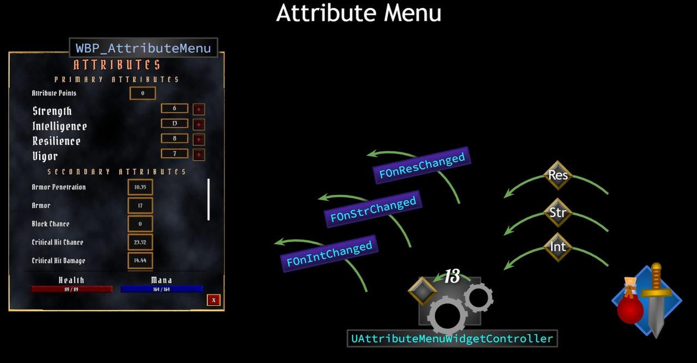

在其中实现定义委托

```C++
DECLARE_DYNAMIC_MULTICAST_DELEGATE_OneParam(FOnAttributeChangedSignature, float, NewAttribute);
```

在创建对应属性的委托

```C++
virtual void BroadcastInitialValues() override;
virtual void BindCallbacksToDependencies() override;

UPROPERTY(BlueprintAssignable, Category="GAS|Attributes")
FOnAttributeChangedSignature OnHealthChanged;

UPROPERTY(BlueprintAssignable, Category="GAS|Attributes")
FOnAttributeChangedSignature OnMaxHealthChanged;

UPROPERTY(BlueprintAssignable, Category="GAS|Attributes")
FOnAttributeChangedSignature OnManaChanged;

UPROPERTY(BlueprintAssignable, Category="GAS|Attributes")
FOnAttributeChangedSignature OnMaxManaChanged;

UPROPERTY(BlueprintAssignable, Category="GAS|Messages")
FMessageWidgetRowSignature MessageWidgetRowDelegate;
```

然后我们使用 GAS 里自带的一个函数`GetGameplayAttributeValueChangeDelegate`

```C++
DECLARE_MULTICAST_DELEGATE_OneParam(FOnGameplayAttributeValueChange, const FOnAttributeChangeData&);

/** Register for when an attribute value changes */
FOnGameplayAttributeValueChange& GetGameplayAttributeValueChangeDelegate(FGameplayAttribute Attribute);
```

配置对应触发的回调

```C++
AbilitySystemComponent->GetGameplayAttributeValueChangeDelegate(AttributeSetBase->GetHealthAttribute()).AddLambda([this](const FOnAttributeChangeData& Data){OnHealthChanged.Broadcast(Data.NewValue);});
AbilitySystemComponent->GetGameplayAttributeValueChangeDelegate(AttributeSetBase->GetMaxHealthAttribute()).AddLambda([this](const FOnAttributeChangeData& Data){OnMaxHealthChanged.Broadcast(Data.NewValue);});
AbilitySystemComponent->GetGameplayAttributeValueChangeDelegate(AttributeSetBase->GetManaAttribute()).AddLambda([this](const FOnAttributeChangeData& Data){OnManaChanged.Broadcast(Data.NewValue);});
AbilitySystemComponent->GetGameplayAttributeValueChangeDelegate(AttributeSetBase->GetMaxManaAttribute()).AddLambda([this](const FOnAttributeChangeData& Data){OnMaxManaChanged.Broadcast(Data.NewValue);});
```

上面是在传入的时候有绑定了一个 lamada 函数，从而在 Value Change 的时候触发我们自定义的委托

> [capture-list] (parameters) -> return-type { body }
>
> - capture-list: 捕获外部变量的列表，可以为空。
> - parameters: 函数参数列表，可以为空。
> - return-type: 返回类型，可以省略（编译器会自动推断）。
> - body: 函数体。

```C++
FOnGameplayAttributeValueChange& UAbilitySystemComponent::GetGameplayAttributeValueChangeDelegate(FGameplayAttribute Attribute)
{
    return ActiveGameplayEffects.GetGameplayAttributeValueChangeDelegate(Attribute);
}

// 查找对应的属性委托，没有就添加
FOnGameplayAttributeValueChange& FActiveGameplayEffectsContainer::GetGameplayAttributeValueChangeDelegate(FGameplayAttribute Attribute)
{
    return AttributeValueChangeDelegates.FindOrAdd(Attribute);
}

// 存储一些委托
TMap<FGameplayAttribute, FOnGameplayAttributeValueChange> AttributeValueChangeDelegates;
// 又回到了这个委托定义
DECLARE_MULTICAST_DELEGATE_OneParam(FOnGameplayAttributeValueChange, const FOnAttributeChangeData&);
```

##### GameplayAttribute

<https://dev.epicgames.com/documentation/en-us/unreal-engine/gameplay-attributes-and-attribute-sets-for-the-gameplay-ability-system-in-unreal-engine>

> `FGameplayAttribute`describes a FGameplayAttributeData or float property inside an attribute set. Using this provides editor UI and helper functions\*

`Attribute` 是由 FGameplayAttributeData 定义的浮点值。 Attributes 能够表达从角色的生命值到角色等级到药瓶的价格等任何数值\*

#### 新版配置委托的实现

我们通过 ASC 去实现对属性的监听，然后再 Controller 里我们不再单独的广播一个属性，而是有属性修改的时候，委托就会触发，将变动的属性一并广播出去。

在 Widget 里，我们可以监听对应的属性变化，委托的广播，不仅仅可以传递数值，也可以传递结构体。

##### 设计思路

1. 新建一个`AttributeMenuWidgetController`实现对 ASC 广播的监听
2. 使用标签匹配的方式，实现对来自广播的数据的检索，知道去更新哪个属性（需要在 C++和 UE 蓝图里都能获取）
3. 创建数据列表，获取到匹配的标签后，拿到对应的数据提交给 widget
4. 在 Widget 里，根据标签更新数据


##### 数据流

1. WidgetController，绑定从 Ability System 广播来的委托，当 attribute 变化时，widgetcontroller 会知道
   1. Set up to receive broadcasts from the ability system when attributes change
2. widgetcontroller 通过这个 attribute，找出对应的 gameplaytag
   1. Map attribute with gameplaytag
   2. fidn a way to reference these gameplay tags(找到一种引用标签的方法)
      1. `RequestGameplayTags(FName("xxx.xxx.xxx"))`可以向 gameplay tag manager 查找 tag
      2. 每次都手写 xxx.xxx.xxx 太容易出错，转而用单例管理
3. 使用 gameplaytag，在 DataAsset(UAttributeInfo)里查找对应的结构体内容
   1. DataAsset capable of receiving gameplay tags and returning our aura attribute info struct
4. 将找到的内容发送给 widget

##### 具体实现

1. ###### 配置 GameplayTags 单例

   1. 创建 C++文件，继承自 None

   2. 创建一个结构体类，将其作为单例，头文件中我们添加一个静态`Get`函数，用于从类直接获取单例。然后创建一个`InitializeNativeGameplayTags()`初始化内部的`Tag`标签，最后创建一个静态属性`FMyGameplayTags`用来存储单例，`Get`返回的就是他

      ```C++
      #pragma once

      #include "CoreMinimal.h"
      #include "GameplayTagContainer.h"

      /**
       * GameplayTags 标签 单例模式
       * 内部包含原生的项目中使用的标签
       */

      struct FMyGameplayTags
      {
      public:
              static const FMyGameplayTags& Get() { return GameplayTags; }
              static void InitializeNativeGameplayTags();

              FGameplayTag Attributes_Primary_Strength;

              FGameplayTag Attributes_Secondary_Armor;

              FGameplayTag InputTag_LMB;
      private:
              static FMyGameplayTags GameplayTags;
      };
      ```

   3. 先用`UGameplayTagsmanager::Get()`拿到游戏标签管理器的单例实例，然后添加一个原生的游戏标签。xxx.xxx.xxx 对应表情管理器的层级，然后我们创建的`FGameplayTag Attributes_Primary_Strength;`存储创建出来的`Gameplaytags`，便于日后使用

```C++
      #include "AuraGameplayTags.h"
      #include "GameplayTagsManager.h"

      // Create instance
      FAuraGameplayTags FAuraGameplayTags::GameplayTags;

      // When we create a gameplay tag, it's registered with the gameplay tag manager.
      // This is an object in our project there's only one of them, and it manages the gameplay tags and we can also use it to add gameplay tags even natively here in C++.
      void FAuraGameplayTags::InitializeNativeGameplayTags()
      {
          /*
           * Primary Attributes
           */

          // Associate the tag with actual gameplay tag variable
          GameplayTags.Attributes_Primary_Strength = UGameplayTagsManager::Get().AddNativeGameplayTag(
             FName("Attributes.Primary.Strength"),
             FString("Increases physical damage")
             );

          /*
           * Secondary Attributes
           */

          GameplayTags.Attributes_Secondary_Armor = UGameplayTagsManager::Get().AddNativeGameplayTag(
             FName("Attributes.Secondary.Armor"),
             FString("Reduces damage taken, improves Block Chance")
             );

          /*
           * Input Tags
           */

          GameplayTags.InputTag_LMB = UGameplayTagsManager::Get().AddNativeGameplayTag(
             FName("InputTag.LMB"),
             FString("Input Tag for Left Mouse Button")
             );
      }
```

```C++
      /**
       * Registers the given name as a gameplay tag, and tracks that it is being directly referenced from code
       * This can only be called during engine initialization, the table needs to be locked down before replication
       *
       * @param TagName The Name of the tag to add
       * @param TagDevComment The developer comment clarifying the usage of the tag
       *
       * @return Will return the corresponding FGameplayTag
       */
      GAMEPLAYTAGS_API FGameplayTag AddNativeGameplayTag(FName TagName, const FString& TagDevComment = TEXT("(Native)"));
```

XXXGameplayTags 按照内容划分，应该归于资源类，那么应该放在什么时候初始化呢？考虑到这个原因，我们应该使用一个资源管理器，去统一的管理所有资源初始化、加载的逻辑（这里可以再去补充看一下 Lyra 的初始化链）

###### 实现资源管理器类

1. 新建一个 C++文件，继承自`AssetManager`

2. 新建一个 Get 获取单例和初始化函数

    ```C++
      UCLASS()
      class AURA_API UAuraAssetManager : public UAssetManager
      {
          GENERATED_BODY()
      public:
          static UAuraAssetManager& Get();

      protected:
          virtual void StartInitialLoading() override;
      };
    ```

    ```C++
      UAuraAssetManager& UAuraAssetManager::Get()
      {
          // 避免引擎还未完全初始化
          check(GEngine);

          // 我们获取到的是引用(&)，所以返回时需要加上*来返回实例
          UAuraAssetManager* AuraAssetManager = Cast<UAuraAssetManager>(GEngine->AssetManager);
          // 解引用，直接返回操作的对象而不是副本
          return *AuraAssetManager;
      }

      // 覆盖父类的StartInitialLoading()，在内部添加对自定义标签的处理
      void UAuraAssetManager::StartInitialLoading()
      {
          Super::StartInitialLoading();

          // Initialize Native Gameplay Tags
          FAuraGameplayTags::InitializeNativeGameplayTags();
          // UAbilitySystemGlobals::Get().InitGlobalData(); // 不是这里的功能
      }
    ```

3. 将引擎默认的资源管理器替换为我们自定义的资源管理器，在 Project Settings->General Settings->Default Classes->Advanced->Asset Manager Class 设置

4. 打开 Project Settings->Project->GameplayTags->Manage Gameplay Tags 查看是否修改成功

5. 测试 GameplayTags 是否生效

    1. 看的测试用例是在 ASC 触发的`AbilityActorInfoSet()`中添加，实际上就是查了一下是否能够调用 GameplayTags 以及读取的内容是否准确

#### 存储 UI 所需要的数据

> ##### 为什么使用 DataAsset 而不是 DataTable？
>
> 1. DataTable 主要用于存储和读取数据，一般我们给策划配表的 csv 文件，直接导入就是 DataTable。
> 2. DataAsset 则是一种将资源整合在一起的方式，用于实现资源管理。通过 DataAsset，可以将某个对象使用所有资源集中在一起，当需要加载该对象时，只需要加载对应的 DataAsset。
> 3. DataAsset 需要手动定义数据结构并添加引用的数据，且只存储引用并不加载。

我们通过代码去修改 DataAsset 里的属性显示的实际的值

##### 配置 DataAsset

1. 创建一个类，继承自 DataAsset

2. 创建 DataAsset 使用的结构体

   1. `AttributeTag`，`AttributeName`，`AttributeDescription`是展示用的，不会实时修改，实际的属性数值`AttributeValue`我们会实时修改，所以添加的是`EditDefaultsOnly`属性

   2. `AttributeInformation`我们用来在面板里添加和配置数据

   3. `FindAttributeInfoForTag`实现通过`Gameplaytag`去获取`FAuraAttributeInfo`数据，最后我们要实现在 C++侧修改数据，UI 侧获取数据

```C++
      USTRUCT(BlueprintType)
      struct FAuraAttributeInfo
      {
          GENERATED_BODY()

          UPROPERTY(EditDefaultsOnly, BlueprintReadOnly)
          FGameplayTag AttributeTag = FGameplayTag();

          UPROPERTY(EditDefaultsOnly, BlueprintReadOnly)
          FText AttributeName = FText();

          UPROPERTY(EditDefaultsOnly, BlueprintReadOnly)
          FText AttributeDescription = FText();

          UPROPERTY(BlueprintReadOnly)
          float AttributeValue = 0.f;
      };

      UCLASS()
      class AURA_API UAttributeInfo : public UDataAsset
      {
          GENERATED_BODY()
      public:
          FAuraAttributeInfo FindAttributeInfoForTag(const FGameplayTag& AttributeTag, bool bLogNotFound = false) const;

          UPROPERTY(EditDefaultsOnly, BlueprintReadOnly, meta = (TitleProperty = "AttributeName"))
          TArray<FAuraAttributeInfo> AttributeInformation;
      };
```

```C++
      FAuraAttributeInfo UAttributeInfo::FindAttributeInfoForTag(const FGameplayTag& AttributeTag, bool bLogNotFound) const
      {
          // 遍历配置的所有FAuraAttributeInfo
          for (const FAuraAttributeInfo& Info : AttributeInformation)
          {
             // 如果有匹配的就返回结构体
            if (Info.AttributeTag.MatchesTagExact(AttributeTag))
            {
               return Info;
            }
          }
          if (bLogNotFound)
          {
             UE_LOG(LogTemp, Error, TEXT("Can't find Info for AttributeTag [%s] on AttributeInfo [%s]."), *AttributeTag.ToString(), *GetNameSafe(this));
          }

          return FAuraAttributeInfo();
      }
```

3. 创建 DataAsset，继承自我们创建的 UAttributeInfo 类，添加所需要的内容

   

#### 将数据同步到 UI 上

> 实现 UI 侧订阅数据，C++侧更新数据

1. ##### `配置AttributeMenuWidgetController`

   1. 覆盖一下父类的初始化属性函数和构建委托的函数，我们后续在这两个函数里实现对属性面板的广播
   2. `AttributeInfoDelegate`设置了`BlueprintAssignable`修饰符，可以在蓝图里作为回调绑定使用
   3. `AttributeInfo`使用`EditDefaultsOnly`，只能在 UE 面板上编辑

```C++
   UCLASS(BlueprintType, Blueprintable)
   class AURA_API UAttributeMenuWidgetController : public UAuraWidgetController
   {
       GENERATED_BODY()
   public:
       virtual void BindCallbacksToDependencies() override;
       virtual void BroadcastInitialValues() override;

       UPROPERTY(BlueprintAssignable, Category = "GAS|Attributes")
       FAttributeInfoSignature AttributeInfoDelegate;,
   protected:

       UPROPERTY(EditDefaultsOnly)
       TObjectPtr<UAttributeInfo> AttributeInfo;

   private:
       void BroadcastAttributeInfo(const FGameplayTag& AttributeTag, const FGameplayAttribute& Attribute) const;
   };
```

```C++
   void UAttributeMenuWidgetController::BindCallbacksToDependencies()
   {
       UAuraAttributeSet* AS = CastChecked<UAuraAttributeSet>(AttributeSet);
       check(AttributeInfo)

       for (auto& Pair : AS->TagsToAttributes)
       {
          // Whatever we bind to this delegate needs the correct signature, the signature we need have to take a const reference to FOnAttributeChangeData
          AbilitySystemComponent->GetGameplayAttributeValueChangeDelegate(Pair.Value()).AddLambda(
             [this, Pair](const FOnAttributeChangeData& Data)
             {
                BroadcastAttributeInfo(Pair.Key, Pair.Value());
             }
          );
       }
   }

   void UAttributeMenuWidgetController::BroadcastInitialValues()
   {
       UAuraAttributeSet* AS = CastChecked<UAuraAttributeSet>(AttributeSet);
       check(AttributeInfo)

       for (auto& Pair : AS->TagsToAttributes)
       {
          BroadcastAttributeInfo(Pair.Key, Pair.Value());
       }
   }

   void UAttributeMenuWidgetController::BroadcastAttributeInfo(const FGameplayTag& AttributeTag,
       const FGameplayAttribute& Attribute) const
   {
       FAuraAttributeInfo Info = AttributeInfo->FindAttributeInfoForTag(AttributeTag);
       Info.AttributeValue = Attribute.GetNumericValue(AttributeSet);
       AttributeInfoDelegate.Broadcast(Info);
   }
```

1. ##### 配置 HUD 类

   1. HUD 类中，我们原先配置了创建`OverlayWidgetController`，用于进入游戏时，主界面`Health`和`Mana`的更新

   2. 现在要添加`AttributeMenuWidget`，自然要同步添加`AttributeMenuWidgetController`

   3. 所以在 HUD 类里，我们就要创建一个承载该实例的变量，并添加一个获取方法

```C++
         UAttributeMenuWidgetController* GetAttributeMenuWidgetController(const FWidgetControllerParams& WCParams);
         UPROPERTY()
         TObjectPtr<UAttributeMenuWidgetController> AttributeMenuWidgetController;
         UPROPERTY(EditAnywhere)
         TSubclassOf<UAttributeMenuWidgetController> AttributeMenuWidgetControllerClass;
```

```C++
         UAttributeMenuWidgetController* AAuraHUD::GetAttributeMenuWidgetController(const FWidgetControllerParams& WcParams)
         {
             // 保证只实例化一次，后续Get的时候复用即可
             if(AttributeMenuWidgetController == nullptr)
             {
                AttributeMenuWidgetController = NewObject<UAttributeMenuWidgetController>(this, AttributeMenuWidgetControllerClass);
                AttributeMenuWidgetController->SetWidgetControllerParams(WcParams);
                AttributeMenuWidgetController->BindCallbacksToDependencies();
             }
             return AttributeMenuWidgetController;
         }
```

4. 创建一个基于`AttributeMenuWidgetController`的蓝图，让我们通过蓝图去设置`AttributeInfor`的数据

    1. 将我们之前创建的 DataAsset 属性数据挂上去
    2. 在 HUD 蓝图上配置好`AttributeMenuWidgetControllerClass`

5. 此时，在 HUD 初始化时，`OverlayWidgetControllerClass`（之前配置好的）和`AttributeMenuWidgetControllerClass`就都会被创建出来使用，接下来就是考虑如何在 UI 里去获得`WidgetController`，我们之前获取`OverlayWidgetController`是在创建 UI 的时候，在 Widget 事件里通过蓝图设置过去的，但是在属性面板里，层级太多，所以我们需要一个新的方式，能够在全局蓝图里获取`WidgetController`

6. ##### 创建 BlueprintFunctionLibrary

    1. 新建一个 C++类继承自`BlueprintFunctionLibrary`

    2. 创建两个静态函数，分别获取`OverlayWidgetController`和`AttributeMenuWidgetController`，使用`BlueprintPure`标记，这样我们可以直接拿到返回的结果

        1. A `BlueprintPure` function is shown as a node with no execution pin. By default functions marked `const` will be exposed as pure functions. To make a const function not a pure function, use `BlueprintPure=false`.

           Pure functions do not cache their results, so be careful when doing any non-trivial amount of work a blueprint pure function. It is good practice to avoid outputting array properties in blueprint pure functions.

           _The function does not affect the owning object in any way and can be executed in a Blueprint or Level Blueprint graph._

           [Unreal Documentation](https://docs.unrealengine.com/4.26/en-US/ProgrammingAndScripting/GameplayArchitecture/Functions/)

           

```C++
         UCLASS()
         class AURA_API UAuraAbilitySystemLibrary : public UBlueprintFunctionLibrary
         {
             GENERATED_BODY()
         public:

             UFUNCTION(BlueprintPure, Category = "AuraAbilitySystemLibrary|WidgetController")
             static UOverlayWidgetController* GetOverlayWidgetController(const UObject* WorldContextObject);

             UFUNCTION(BlueprintPure, Category = "AuraAbilitySystemLibrary|WidgetController")
             static UAttributeMenuWidgetController* GetAttributeMenuWidgetController(const UObject* WorldContextObject);
         };
```

​
先从世界上下文对象中获取到本地的`PlayerController`，然后根据`PlayerController`获取到所需的配置项，再从HUD身上的函数获取`WidgetController`

```C++
         UOverlayWidgetController* UAuraAbilitySystemLibrary::GetOverlayWidgetController(const UObject* WorldContextObject)
         {
             // 获取到PlayerController，需要传入一个世界空间上下文的对象，用于得到对应世界中的PC列表，0就代表本地使用的PC
             if (APlayerController* PC = UGameplayStatics::GetPlayerController(WorldContextObject, 0))
             {
                // 从PlayerController，我们就能获取到HUD
                if (AAuraHUD* AuraHUD = Cast<AAuraHUD>(PC->GetHUD()))
                {
                   AAuraPlayerState* PS = PC->GetPlayerState<AAuraPlayerState>();
                   UAbilitySystemComponent* ASC = PS->GetAbilitySystemComponent();
                   UAttributeSet* AS = PS->GetAttributeSet();
                   const FWidgetControllerParams WidgetControllerParams(PC, PS, ASC, AS);
                   return AuraHUD->GetOverlayWidgetController(WidgetControllerParams);
                }
                return nullptr;
             }
             return nullptr;
         }


         /**
          * Returns the player controller found while iterating through the local and available remote player controllers.
          * On a network client, this will only include local players as remote player controllers are not available.
          * The index will be consistent as long as no new players join or leave, but it will not be the same across different clients and servers.
          *
          * @param PlayerIndex   Index in the player controller list, starting first with local players and then available remote ones
          */
         UFUNCTION(BlueprintPure, Category="Game", meta=(WorldContext="WorldContextObject", UnsafeDuringActorConstruction="true"))
         static ENGINE_API class APlayerController* GetPlayerController(const UObject* WorldContextObject, int32 PlayerIndex);
```

3. 这时候，我们就能在任意蓝图里调用`GetOverlayWidgetController`和`GetAttributeMenuWidgetController`
   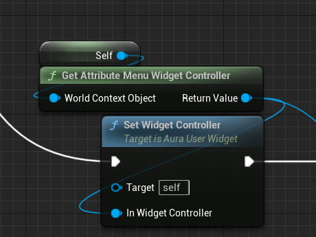

   > 补充一点，我们在设置`OverlayWidgetController`的时候，是在 C++里初始化 UI 属性时显示的
   >
   > ```C++
   > void AAuraHUD::InitOverlay(APlayerController* PC, APlayerState* Ps, UAbilitySystemComponent* ASC, UAttributeSet* AS)
   > {
   >     checkf(OverlayWidgetClass, TEXT("Overlay Widget Class uninitialized, pleased fill out BP_AuraHUD"));
   >     checkf(OverlayWidgetControllerClass, TEXT("Overlay Widget Controller Class uninitialized, pleased fill out BP_AuraHUD"));
   >
   >     UUserWidget* Widget =  CreateWidget<UUserWidget>(GetWorld(), OverlayWidgetClass);
   >     OverlayWidget = Cast<UAuraUserWidget>(Widget);
   >
   >     const FWidgetControllerParams WidgetControllerParams(PC, Ps, ASC, AS);
   >     UOverlayWidgetController* WidgetController = GetOverlayWidgetController(WidgetControllerParams);
   >
   >     OverlayWidget->SetWidgetController(WidgetController);
   >     WidgetController->BroadcastInitialValues();
   >     Widget->AddToViewport();
   > }
   >
   > void UAuraUserWidget::SetWidgetController(UObject* InWidgetController)
   > {
   >     WidgetController = InWidgetController;
   >     WidgetControllerSet();
   > }
   > ```
   >
   > 这里，我们先`OverlayWidget->SetWidgetController(WidgetController);`设置对应的`WidgetController`，然后再调用`WidgetControllerSet();`函数，这个函数在 UI 里设置各种事件
   >
   > 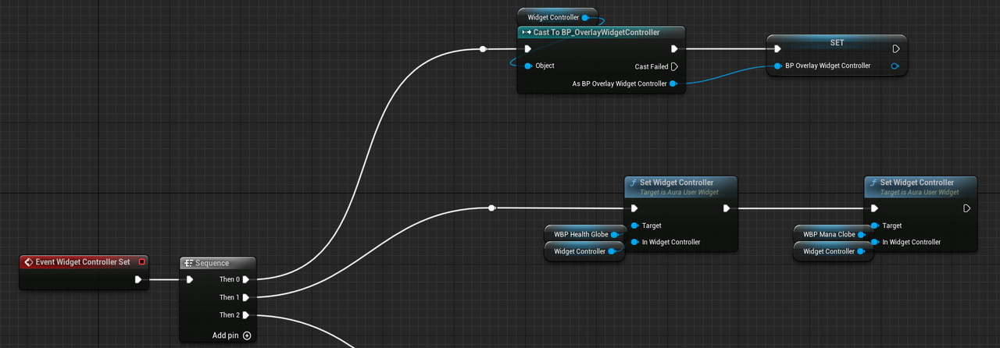
   >
   > 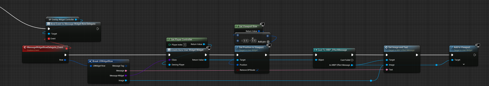
   >
   > 然后设置`AttributeMenuController`，则是在点击按钮，`AttributeMenu`菜单初始化，`construct`的时候使用`SetWidgetController`设置的（见下图）

1. ##### 广播数据，修改 UI

   1. 打开 AttributeMenu 菜单时，会做一个 Event Constuct 操作

      ​

   2. 在最后一步，有`Broadcast Initial Values`操作来广播所有的数据，首先通过 tag 去获取对应的 Attribute 属性，例如 StrengthTag 就获得 StrengthAttribute 之类的，对应的 Attribute 属性其实就是我们在`AuraAttributeSet`里定义的

      ```C++
      UPROPERTY(BlueprintReadOnly, ReplicatedUsing = OnRep_Strength, Category = "Primary Attributes")
      FGameplayAttributeData Strength;
      ATTRIBUTE_ACCESSORS(UAuraAttributeSet, Strength);
      ```

      然后我们就能够得到 Attribute 的值，并且广播出去

      ```C++
      void UAttributeMenuWidgetController::BroadcastInitialValues()
      {
          // 如何获取我们想要的AuraAttributeSet? 我们本身定义了一个AttributeSet变量(父类AuraWidgetController里定义，在设置Controller的时候应该传入了对应的基础AttributeSet)，直接Cast
          UAuraAttributeSet* AS = CastChecked<UAuraAttributeSet>(AttributeSet);
          check(AttributeInfo)

          for (auto& Pair : AS->TagsToAttributes)
          {
             BroadcastAttributeInfo(Pair.Key, Pair.Value());
          }
      }

      void UAttributeMenuWidgetController::BroadcastAttributeInfo(const FGameplayTag& AttributeTag,
          const FGameplayAttribute& Attribute) const
      {
          // 通过tag找到attributeinfo这个DataAsset里存储的属性数据
          FAuraAttributeInfo Info = AttributeInfo->FindAttributeInfoForTag(AttributeTag);

          /*
              别忘了，FGameplayAttribute是用来描述FGameplayAttributeData的，Data里面就包含属性的各种数据，如基础值、当前值、最大值

              // Returns the current value of an attribute
              float GetNumericValue(const UAttributeSet* Src) const;
          */
          Info.AttributeValue = Attribute.GetNumericValue(AttributeSet);
          AttributeInfoDelegate.Broadcast(Info);
      }

      void UAttributeMenuWidgetController::BindCallbacksToDependencies()
      {
          UAuraAttributeSet* AS = CastChecked<UAuraAttributeSet>(AttributeSet);
          check(AttributeInfo)

          for (auto& Pair : AS->TagsToAttributes)
          {
             // Whatever we bind to this delegate needs the correct signature, the signature we need have to take a const reference to FOnAttributeChangeData
             AbilitySystemComponent->GetGameplayAttributeValueChangeDelegate(Pair.Value()).AddLambda(
                [this, Pair](const FOnAttributeChangeData& Data)
                {
                   BroadcastAttributeInfo(Pair.Key, Pair.Value());
                }
             );
          }
      }

      // UAttributeSet示例
      UPROPERTY(BlueprintReadOnly, ReplicatedUsing = OnRep_Strength, Category = "Primary Attributes")
      FGameplayAttributeData Strength;
      ATTRIBUTE_ACCESSORS(UAuraAttributeSet, Strength);
      ```

      1. 这里其实还有一个旧版

         ```C++
         void UAttributeMenuWidgetController::BroadcastInitialValues()
         {
             // 如何获取我们想要的AuraAttributeSet? 我们本身定义了一个AttributeSet变量(父类AuraWidgetController里定义，在设置Controller的时候应该传入了对应的基础AttributeSet)，直接Cast
             UAuraAttributeSet* AS = CastChecked<UAuraAttributeSet>(AttributeSet);
             check(AttributeInfo)

             // 每个attribute都用一个FindAttributeInfoForTag去查找
             FAuraAtributeInfo StrengthInfo = AttributeInfo->FindAttributeInfoForTag(FAuraGameplayTags::Get().Attributes_Primarty_Strength);
             // Attribute标记的特性，自动封装了Get操作
             StrengthInfo.AttributeValue = AS->GetStrength();
             AttributeInfoDelegate.Broadcast(StrengthInfo);

             // 每一个Attribute都需要设置对应的标签查找
             FAuraAtributeInfo IntelligenceInfo = AttributeInfo->FindAttributeInfoForTag(FAuraGameplayTags::Get().Attributes_Primarty_Intelligence);
             IntelligenceInfo.AttributeValue = AS->GetIntelligence();
             AttributeInfoDelegate.Broadcast(IntelligenceInfo);
         }
         ```

      2. 再补充说一下，TagsToAttributes 的实现

         1. 首先，是为了解决旧版每次设置 Attribute 都需要手写对应的标签查找出现的

         2. 所以，我们会存储一个 map，传入 tags 就能找到对应的 Attribute

            ```C++
            /*
                C++11后，typedef就改成using了，都是一个功能，为现有类型创建别名
                在这个例子中，using创建一个别名TStaticFuncPtr，它表示 TBaseStaticDelegateInstance 类模板的一个特定成员类型 FFuncPtr。
                实现效果就是：
                   接受一个类型参数 T，并将其转换为 TBaseStaticDelegateInstance<T, FDefaultDelegateUserPolicy>::FFuncPtr 类型

                TBaseStaticDelegateInstance 是一个类模板，用于创建静态委托实例。它通常用于处理函数指针或成员函数指针。
                FDefaultDelegateUserPolicy 是一个策略类，用于定义委托的行为。
            */
            template<class T>
            using TStaticFuncPtr = typename TBaseStaticDelegateInstance<T, FDefaultDelegateUserPolicy>::FFuncPtr;

            /*
                StaticFuncPtr<FGameplayAttribute()> 表示一个返回 FGameplayAttribute 类型且没有输入参数的函数指针
                TagsToAttributes 是一个映射，将 FGameplayTag 映射到一个返回 FGameplayAttribute 的函数指针
            */
            TMap<FGameplayTag, TStaticFuncPtr<FGameplayAttribute()>> TagsToAttributes;
            ```

         3. 这之后，我们再在 AttributeSet 初始化的时候，为 TagsToAttributes 添加对应的 map

            ```C++
            /* Primary Attributes */
            // Associate Tags to Attributes
            TagsToAttributes.Add(GameplayTags.Attributes_Primary_Strength, GetStrengthAttribute);

            /* Secondary Attributes */
            TagsToAttributes.Add(GameplayTags.Attributes_Secondary_Armor, GetArmorAttribute);
            ```

         4. 然后，这种 TagsToAttribute 也有旧实现方式

            ```C++
            /*
                DECLARE_DELEGATE_RetVal宏代表是一个带有返回值的委托
                FGameplayAttributes是返回的类型
                FAttributeSignature是委托的名称

                该委托可以绑定一个不接收任何参数的函数，然后返回FGameplayAttribute
            */
            DECLARE_DELEGATE_RetVal(FGameplayAttribute, FAttributeSignature);

            // 定义Map
            TMap<FGameplayTag, FAttributeSignature> TagsToAttributes;

            // 在初始化时为Map添加值
            UAuraAttributeSet::UAuraAttributeSet()
            {
                const FAuraGameplayTags& GameplayTags = FAuraGameplayTags::Get();

                // UAuraAttributeSet::GetStrengthAttribute 是一个静态成员函数，因此使用 BindStatic
                FAttributeSignature StrengthDelegate;
                StrengthDelegate.BindStatic(UAuraAttributeSet::GetStrengthAttribute);
                TagsToAttributes.Add(GameplayTags.Attributes_Primary_Strength, StrengthDelegate);
            }

            // 获取AttributeValue的时候要用Execute()，触发绑定的函数
            FGameplayAttribute Attribute = xxx.Value.Execute();
            ```

   3. UI 菜单上对应的位置绑定对应的标签，实现对于数据的监听

      1. 这里的 AttributeTag 是我们自定义的变量，到时候在 WBP_Attribute 里去设置对应属性的 ta
         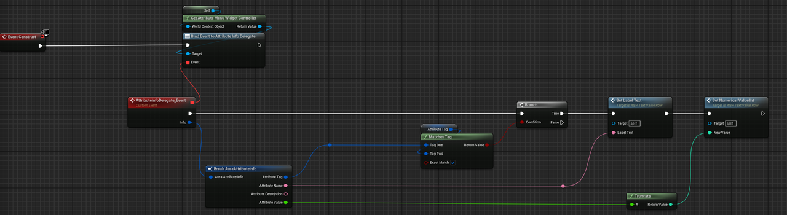

   4. 通过 Attribute tag 设置值

      1. 了解显示的结构

         1. 在 AttributeMenu 菜单，知道每行都是继承自 WBP_TextValueRow 的，后面带按钮的也是先继承自 WBP_TextValueButtonRow，再继承自 WBP_TextValueRow
            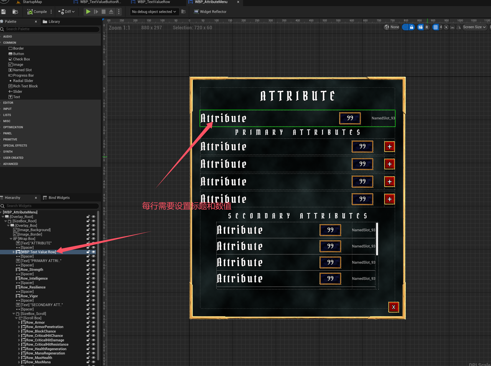
         2. 设置对应的值
            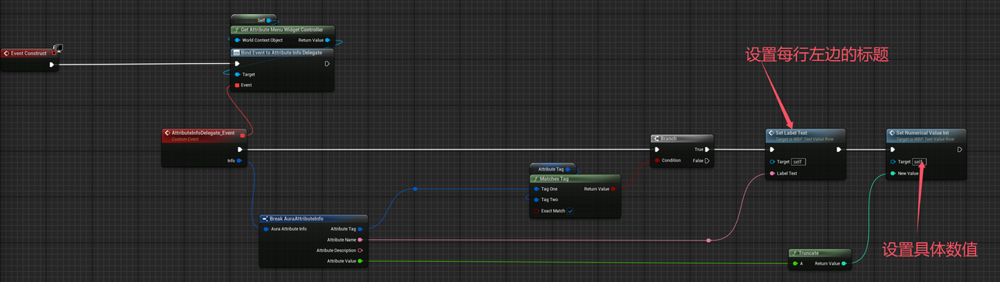
            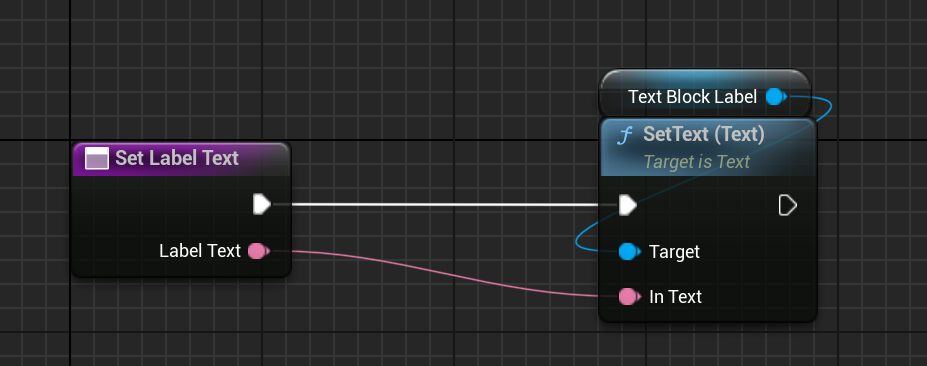
            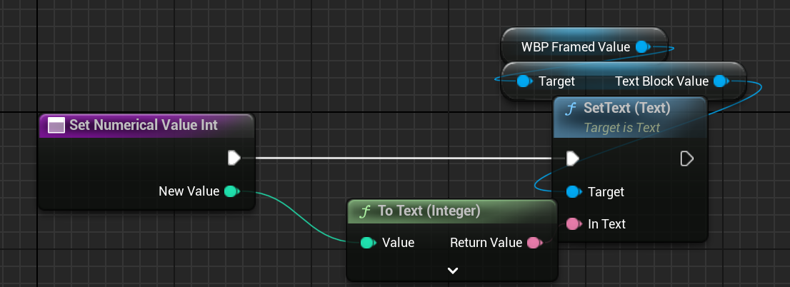

         3. 展示一下完整的结构，了解上面的变量中 WBP_FrameValue 和 TextBlockLabel 都对应着什么，一个是对应数值框模版，一个是对应着前面的标题 Text

            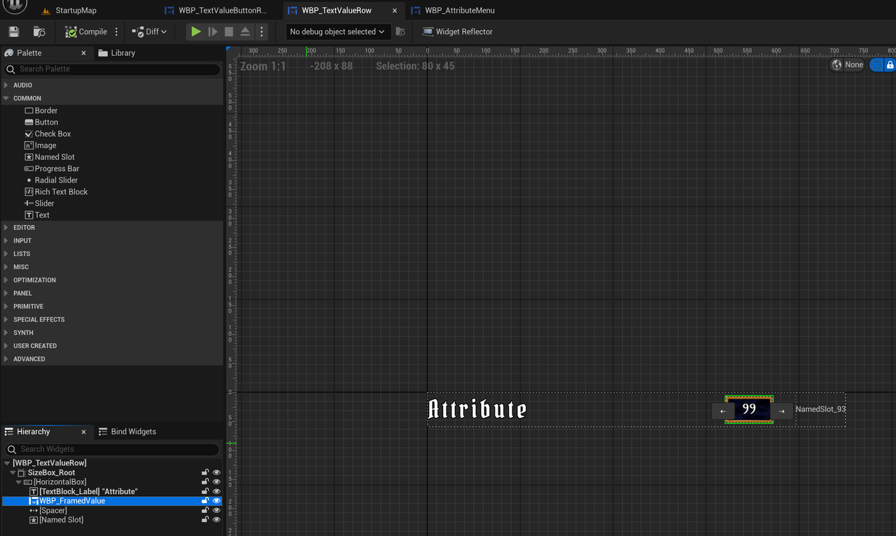

            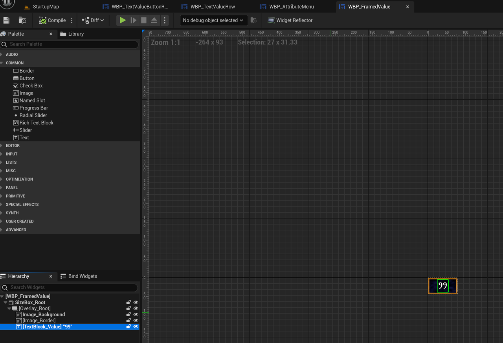

      2. 我们发现，每行的数值都是和标签绑定的，只要 Attribute Info 发出消息，没啊很难过都根据自己的标签去更新对应的内容，但是在哪里给每行设置其标签呢？
         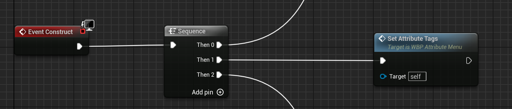
         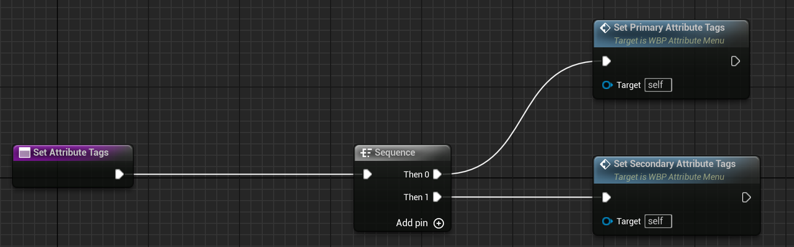
         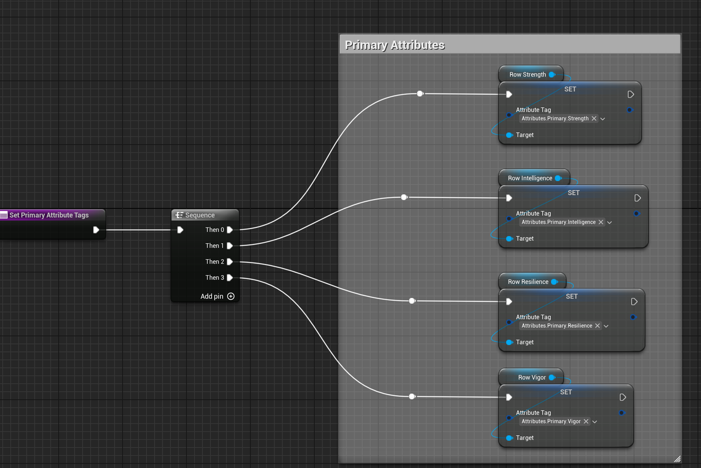
         这些 RowStrength 变量，就是对应的 UI
         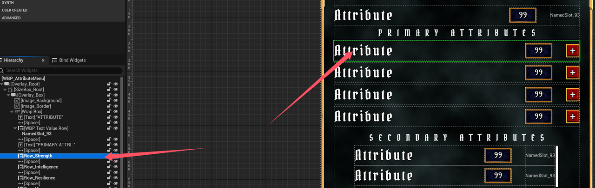
         
