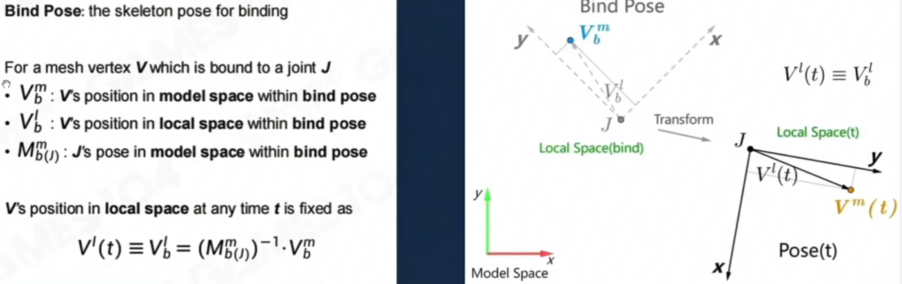
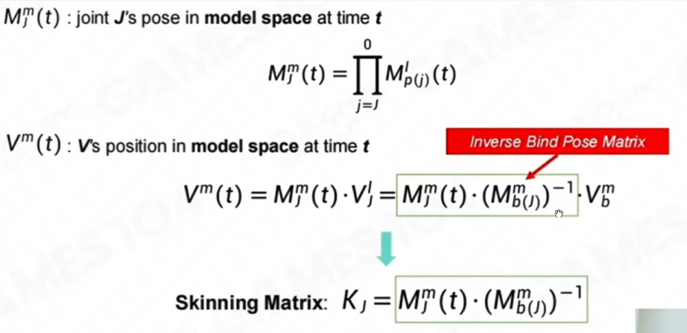
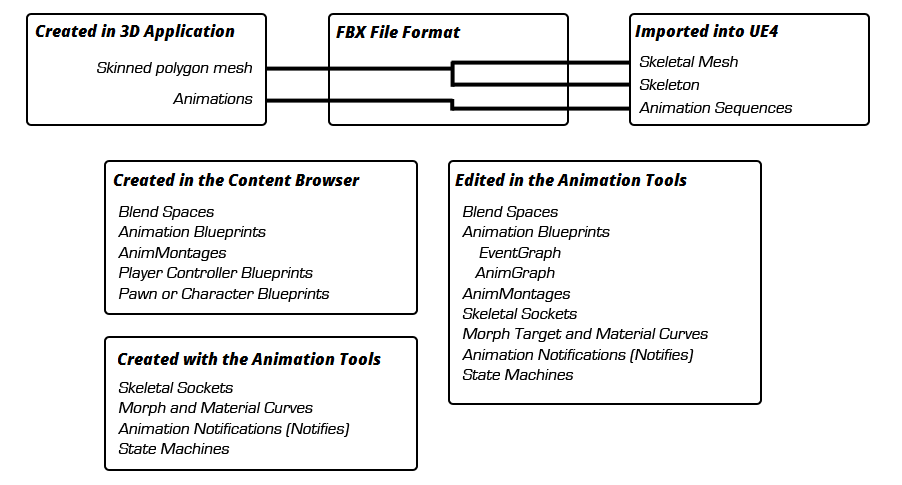
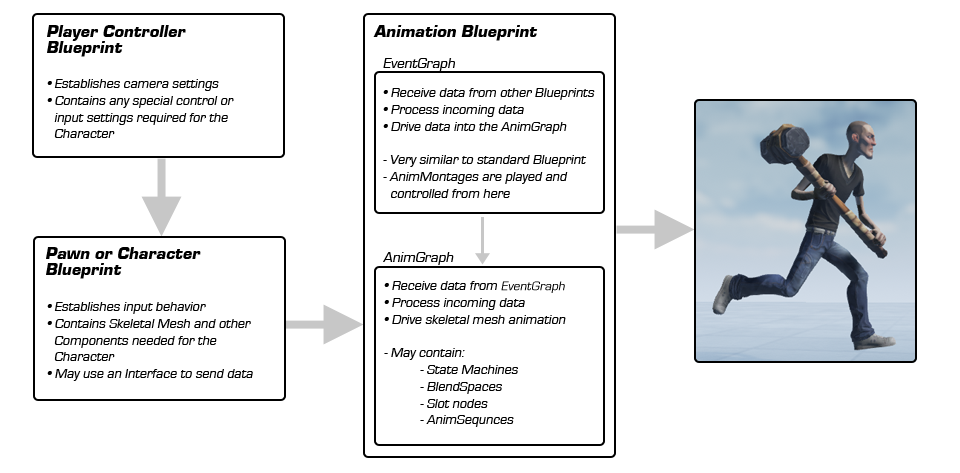
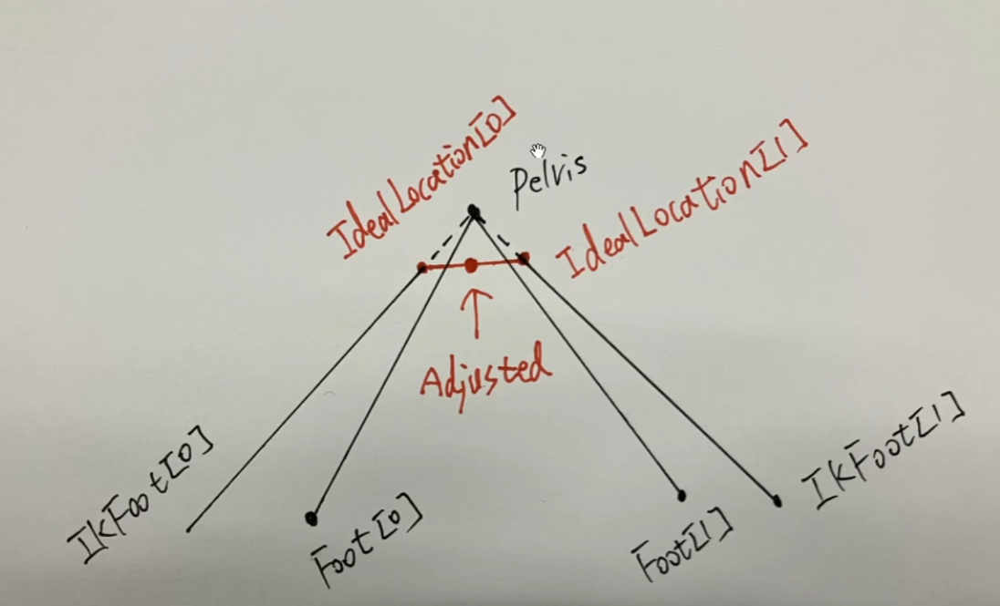

## UE 动画系统 Copy

### 动画基础

#### 顶点动画

优点：记录每一帧，拥有最高的自由度；

缺点：要记录的信息非常多，常见应用情景：人物表情、捏脸等

#### 骨骼动画

记录骨骼的 transform 信息，在程序运行过程中，根据骨骼当前位置计算出真正的顶点的位置信息

记录每个顶点绑定的是哪个骨骼和相对位置

骨骼树中，每一个记录的都是相对其父节点的位置，所以要获得世界坐标，就需要一层层的计算上去

> 渲染这一套是根据上面两个信息拿到空间矩阵？
> 
> 
> Cite: game104





> 首先，对于骨骼动画来说，他的运动趋势实际上是不会频繁变化的
> 所以对于满帧的数据而言，在容许一定容差的前提下，其可以通过在其中将若干帧数据提取为关键帧，然后其他帧借助线性插值的方式来生成
> 这个算法要解决的主要问题是如何从满帧的骨骼动画数据中，再给定容差的前提下，提取出关键帧。主要优点是生成的数据依旧是关键帧数据，所以不需要改变原本的文件格式与接口，兼容性较好
> 首先给定一个计算关键帧之间的差的函数 f，对于大多数骨骼动画而言，其主要动画以旋转为主，所以这里 f 取骨骼中三个角度差的平方和，作为 f，给定误差累计阈值 k，对于任意一个骨骼 bonei，以及其满帧数据 bonei0，bonei1... bonein
> 首先将 bonei0 加入关键帧列表中，然后从 bonei0 开始向后步进，对每次步进到的 boneim，我们做这样的运算
> 首先我们“假定”boneim 为关键帧
> 接下来我们根据 bonei0 与 boneim，以插值的方式生成一组满帧的数据，计为 bonei0%，bonei1%，。。。boneim%
> 然后对将 bonei0% 与 bonei0；bonei1% 与 bonei1。。。boneim 与 boneim% 做之前提到的 f 运算，得到一组误差值，将其累加起来，计为 km，当我们步进到第一个 km，其使得 km＞k（误差累计阈值）时，将第 m-1 帧的数据，bonem-1 记录到关键帧列表中，接下来就是 bonem-1 开始向后步进，将 bonem-1 和后面的帧去做上面的插值与误差累计计算，从而找到全部能使得累计误差小于误差累计阈值 k 的关键帧，然后最后一帧别忘了也丢进去
> 再是针对这次需求的算法改进，如果需要考虑客户端与服务器延迟，那么可以在这一步额外增加校验，如果两帧之间的差（时间上的差）大于给定的延迟阈值，那么即使误差累积函数没有达到要求，也将其记录到关键帧列表中并发送
> 几个注意点是，这个算法可以在每个骨骼上分开运行，所以在大部分帧上，并不会记录全部的骨骼关键帧，这个对你的数据同步带宽上可能会有帮助，但在写同步代码的时候可能要注意
> 另一个是尽量走父骨骼空间的位置旋转去做 f 运算，这样压缩效果一般更好，用世界空间的话估计压缩效果锐减

### 代码部分

#### 骨骼模型基础信息

UE 里，一个模型就是一个 `SkeletalMesh`

`SkeletalMesh` 类下有 `FSkeletalMeshRenderData`

`FSkeletalMeshRenderData` 第一层有 `FSkeletalMeshLODRenderData` 区分

`FSkeletalMeshLODRenderData` 下又有 `StaticVertexBuffers`; `SkinWeightVertexBuffer` 这些已经处理好的数据，原始的数据则在

```cpp
#if WITH_EDITOR
    _/**_
_     * Initialize render data (e.g. vertex buffers) from model info_
_     * @param InLODModel The model to build the render data from._
_     * @param InVertexAttributeInfos The vertex attributes to possibly include and their stored data type._
_     * @param InBuildFlags See ESkeletalMeshVertexFlags._
_     */_
_    _void ENGINE_API BuildFromLODModel(
       const FSkeletalMeshLODModel* InLODModel,
       TConstArrayView<FSkeletalMeshVertexAttributeInfo> InVertexAttributeInfos = {},
       ESkeletalMeshVertexFlags InBuildFlags = ESkeletalMeshVertexFlags::None
       );
#endif _// WITH_EDITOR_ ```
```

`LODModel` 又将 Mesh 分成很多 `SkelMeshSection`，每个 `Section` 里面又存放很多信息，包括 `SoftSkinVertex`(5.3 中没在 `Section` 类中找到，但是文件中仍然存在，新版这个没看懂是 `BaseVertexIndex` 还是 `FMeshToMeshVertData`)，然后一组顶点构成一个 `Section`

骨骼的类 `USkeleton`，5.1 以后用的是 `FReferenceSkeleton`，里面包含骨骼所有的信息，`FMeshBoneInfo`、`FTransform`

#### 动画序列

Animation Sequence 存储所有的骨骼在每一帧的 `Transform` 信息

`UAnimSequence` 里，原始动画数据很大，他自己有做一个 `FCompressedAnimSequence`，在用的时候再提取出来，这里的压缩算法后面再解释。

还有一个 `FBoneAnimationTrack`，存储一根骨骼所有帧的信息，包含 `FRawAnimSequenceTrack`

每一帧的数据用 `GetBonePose`，根据时间算出两个索引？

`BuildPoseFromModel` 从 DataModel 提取出 OutPose，再传入时间（根据时间，找出两帧的索引，再做一个插值）。如果是打包以后，就会有一个 `DecompressPose` 先去提取数据（提取哪些，要补充一下具体的内容）

#### 动画信息

导入的 fbx 会自动转成 `AnimSequenece`

`AnimSequence` 有一个基类 `AnimSequenceBase`，里面有一个指针指向 `UAnimDataModel`，

`UAnimDataModel` 里包含了动画的一些原始信息，包含动画的长度、帧率等，也有一个 `FBoneAnimationTrack`

#### 动画蓝图如何更新动画

在 `Character` 中，我们会挂载一个 `USkeletalMeshComponent` 绑定角色模型，而在这个类中，又有 `UAnimInstance` 驱动动画，`UAnimInstance` 下用 `FAnimInstanceProxy` 代理类实现多线程的更新

`USkeletalMeshComponent` 有一个父类 `USkinnedMeshComponent`，在他的 `TickComponent` 中，我们会去调用 `DispatchParallelTickPose` 更新动画，`DispatchParallelTickPose` 是虚函数，所以最后还是 `USkeletalMeshComponent` 的 `DispatchParallelTickPose` 完成具体的实现。

`USkeletalMeshComponent` 的 `DispatchParallelTickPose` 中，会有一个判断

```cpp
if(bDoParallelUpdate)
{
    // 执行多线程更新
    DispatchParallelEvaluationTasks(TickFunction);
}
else
{
    _// we cant update on a worker thread, so perform the work here_
_    _DoParallelEvaluationTasks_OnGameThread(); // 只在主线程更新
    PostAnimEvaluation(AnimEvaluationContext);
}
```

`DispatchParallelEvaluationTasks` 内部也不是直接更新，而是使用

```cpp
_// start parallel work_
check(!IsValidRef(ParallelAnimationEvaluationTask));
ParallelAnimationEvaluationTask = TGraphTask<FParallelAnimationEvaluationTask>::CreateTask().ConstructAndDispatchWhenReady(this);
```

创建一个 `FParallelAnimationEvaluationTask`，然后放在多线程里面去执行

```cpp
_// set up a task to run on the game thread to accept the results_
FGraphEventArray Prerequistes;
Prerequistes.Add(ParallelAnimationEvaluationTask);
FGraphEventRef TickCompletionEvent = TGraphTask<FParallelAnimationCompletionTask>::CreateTask(&Prerequistes).ConstructAndDispatchWhenReady(this);
```

这个 `Task` 只是一个辅助的作用，在 `DoTask` 里，又会反过来调用 `USkeletalMeshComponent` 的 `ParallelAnimationEvaluation`，如果之前是 `DoParallelEvaluationTasks_OnGameThread` 主线程更新，会直接调用 `ParallelAnimationEvaluation`，不走 `Task` 了

`ParallelAnimationEvaluation` 函数中，就有 `PerformAnimationProcessing` 处理动画，分成两个重要的步骤，第一，使用 `ParallelUpdateAnimation` 更新 `AnimInstance`；第二，使用 `EvaluateAnimation` 真正去计算 Pose。

`ParallelUpdateAnimation` 用来计算动画相关的参数，例如 Blend 参数。

计算完成后，使用 `EvaluateAnimation` 提取出 Pose（在 Sequence 章节中有 `GetBonePose`，根据时间提取出两帧的骨骼的信息，看要不要做插值），具体执行流程为 `EvaluateAnimation` 调用 `AnimInstance` 的 `ParallelEvaluateAnimation`，再使用 `Proxy` 调用 `EvaluateAnimation`，到这一步，就能深入一层，调用到 `EvaluateAnimation_WithRoot` 了，这里就开始回溯，从根节点开始更新每个节点，`EvaluateAnimationNode_WithRoot`，最终调用到 `FAnimNode_Base` 的 `Evaluate_AnyThread`

`FAnimNode_Base` 中有 `GetEvaluateGraphExposedInputs().Execute(Context)` 递归找出蓝图中连起来的输入节点，触发更新

动画蓝图里每个节点最后都是继承自 `FAnimNode_Base`，所以都会有两个重要的虚函数，一个是 `Updatexxxx`，一个是 `Evaluatexxxx`

```cpp
void FAnimNode_SequencePlayerBase::UpdateAssetPlayer(const FAnimationUpdateContext& Context)
{
    DECLARE_SCOPE_HIERARCHICAL_COUNTER_ANIMNODE(UpdateAssetPlayer);

    GetEvaluateGraphExposedInputs().Execute(Context);

    UAnimSequenceBase* CurrentSequence = GetSequence();
    if (CurrentSequence && !ensureMsgf(!CurrentSequence->IsA<UAnimMontage>(), TEXT("Sequence players do not support anim montages.")))
    {
       CurrentSequence = nullptr;
    }

    if (CurrentSequence != nullptr && CurrentSequence->GetSkeleton() != nullptr)
    {
       const float CurrentPlayRate = GetPlayRate();
       const float CurrentPlayRateBasis = GetPlayRateBasis();

       InternalTimeAccumulator = FMath::Clamp(InternalTimeAccumulator, 0.f, CurrentSequence->GetPlayLength());
       const float AdjustedPlayRate = PlayRateScaleBiasClampState.ApplyTo(GetPlayRateScaleBiasClampConstants(), FMath::IsNearlyZero(CurrentPlayRateBasis) ? 0.f : (CurrentPlayRate / CurrentPlayRateBasis), Context.GetDeltaTime());
       CreateTickRecordForNode(Context, CurrentSequence, IsLooping(), AdjustedPlayRate, false);
    }

#if WITH_EDITORONLY_DATA
    if (FAnimBlueprintDebugData* DebugData = Context.AnimInstanceProxy->GetAnimBlueprintDebugData())
    {
       DebugData->RecordSequencePlayer(Context.GetCurrentNodeId(), GetAccumulatedTime(), CurrentSequence != nullptr ? CurrentSequence->GetPlayLength() : 0.0f, CurrentSequence != nullptr ? CurrentSequence->GetNumberOfSampledKeys() : 0);
    }
#endif

    TRACE_ANIM_SEQUENCE_PLAYER(Context, *this);
    TRACE_ANIM_NODE_VALUE(Context, TEXT("Name"), CurrentSequence != nullptr ? CurrentSequence->GetFName() : NAME_None);
    TRACE_ANIM_NODE_VALUE(Context, TEXT("Asset"), CurrentSequence);
    TRACE_ANIM_NODE_VALUE(Context, TEXT("Playback Time"), InternalTimeAccumulator);
}
```

```cpp
void FAnimNode_SequencePlayerBase::Evaluate_AnyThread(FPoseContext& Output)
{
    DECLARE_SCOPE_HIERARCHICAL_COUNTER_ANIMNODE(Evaluate_AnyThread);

    UAnimSequenceBase* CurrentSequence = GetSequence();
    if (CurrentSequence != nullptr && CurrentSequence->GetSkeleton() != nullptr)
    {
       const bool bExpectedAdditive = Output.ExpectsAdditivePose();
       const bool bIsAdditive = CurrentSequence->IsValidAdditive();

       if (bExpectedAdditive && !bIsAdditive)
       {
          FText Message = FText::Format(LOCTEXT("AdditiveMismatchWarning", "Trying to play a non-additive animation '{0}' into a pose that is expected to be additive in anim instance '{1}'"), FText::FromString(CurrentSequence->GetName()), FText::FromString(Output.AnimInstanceProxy->GetAnimInstanceName()));
          Output.LogMessage(EMessageSeverity::Warning, Message);
       }

       FAnimationPoseData AnimationPoseData(Output);
       CurrentSequence->GetAnimationPose(AnimationPoseData, FAnimExtractContext(UE_AnimationSystem_cast<double>(InternalTimeAccumulator), Output.AnimInstanceProxy->ShouldExtractRootMotion(), DeltaTimeRecord, IsLooping()));
    }
    else
    {
       Output.ResetToRefPose();
    }
}
```

#### 蒙太奇源码分析

`UAnimMontage` 类里存的动画片段是 `FCompositeSection`

Slot 则是 `FSlotAnimationTrack`，每个 Track 里有 `SlotName` 和 `FAnimTrack`，`FAnimTrack` 里的是 `FAnimSegment`，然后这里面又包括 `UAnimSequenceBase`，最后就是 `FRawCurveTracks` 和 `FAnimNotifyTrack` 了

出发点我们从 `UAnimInstance` 里 `Montage_Play` 开始，跳转到 `Montage_PlayInternal`，创建一个蒙太奇实例，初始化相关数据，添加到一个包含所有的蒙太奇的数组里，到时候每一帧更新都会找到该数组进行更新

更新也是和之前一样，从 `Tick` 里一直调用到 `UpdateMontage`，先用 `Montage_UpdateWeight` 更新相关数据，再用 `Montage_Advance` 更新 DeltaSeconds

```cpp
_// update montage weight_
Montage_UpdateWeight(DeltaSeconds);

_// update montage should run in game thread_
_// if we do multi threading, make sure this stays in game thread. _
_// This is because branch points need to execute arbitrary code inside this call._
Montage_Advance(DeltaSeconds);
```

```cpp
void UAnimInstance::Montage_UpdateWeight(float DeltaSeconds)
{
    if (MontageInstances.IsEmpty())
    {
       return;
    }

    SCOPE_CYCLE_COUNTER(STAT_Montage_UpdateWeight);

    _// go through all montage instances, and update them_
_    // and make sure their weight is updated properly_
_    _for (int32 I=0; I<MontageInstances.Num(); ++I)
    {
       if ( MontageInstances[I] )
       {
          MontageInstances[I]->UpdateWeight(DeltaSeconds);
       }
    }
}
```

```cpp
void UAnimInstance::Montage_Advance(float DeltaSeconds)
{
    _// We're about to tick montages, queue their events to they're triggered after batched anim notifies._
_    _bQueueMontageEvents = true;

    if (MontageInstances.IsEmpty())
    {
       return;
    }

    SCOPE_CYCLE_COUNTER(STAT_Montage_Advance);

    _// go through all montage instances, and update them_
_    // and make sure their weight is updated properly_
_    _for (int32 InstanceIndex = 0; InstanceIndex < MontageInstances.Num(); InstanceIndex++)
    {
       FAnimMontageInstance* const MontageInstance = MontageInstances[InstanceIndex];
       _// should never be NULL_
_       _ensure(MontageInstance);
       if (MontageInstance && MontageInstance->IsValid())
       {
          bool const bUsingBlendedRootMotion = (RootMotionMode == ERootMotionMode::RootMotionFromEverything);
          bool const bNoRootMotionExtraction = (RootMotionMode == ERootMotionMode::NoRootMotionExtraction);

          _// Extract root motion if we are using blend root motion (RootMotionFromEverything) or if we are set to extract root _
_          // motion AND we are the active root motion instance. This is so we can make root motion deterministic for networking when_
_          // we are not using RootMotionFromEverything_
_          _bool const bExtractRootMotion = !MontageInstance->IsRootMotionDisabled() && (bUsingBlendedRootMotion || (!bNoRootMotionExtraction && (MontageInstance == GetRootMotionMontageInstance())));

          FRootMotionMovementParams LocalExtractedRootMotion;
          FRootMotionMovementParams* RootMotionParams = nullptr;
          if (bExtractRootMotion)
          {
             RootMotionParams = (RootMotionMode != ERootMotionMode::IgnoreRootMotion) ? &ExtractedRootMotion : &LocalExtractedRootMotion;
          }

          MontageInstance->MontageSync_PreUpdate();
          MontageInstance->Advance(DeltaSeconds, RootMotionParams, bUsingBlendedRootMotion);

          _// If MontageInstances has been modified while executing MontageInstance->Advance(), MontageInstance is unsafe to_
_          // access further. This happens for example if MontageInstance->Advance() triggers an anim notify in which the user_
_          // destroys the owning actor which in turn calls UninitializeAnimation(), or when the anim notify causes any montage_
_          // to stop or start playing. We just check here if the current MontageInstance is still safe to access._
_          _if (!MontageInstances.IsValidIndex(InstanceIndex) || MontageInstances[InstanceIndex] != MontageInstance)
          {
             break;
          }

          MontageInstance->MontageSync_PostUpdate();

#if DO_CHECK && WITH_EDITORONLY_DATA && 0
          _// We need to re-check IsValid() here because Advance() could have terminated this Montage._
_          _if (MontageInstance.IsValid())
          {
             _// print blending time and weight and montage name_
_             _UE_LOG(LogAnimMontage, Warning, TEXT("%d. Montage (%s), DesiredWeight(%0.2f), CurrentWeight(%0.2f), BlendingTime(%0.2f)"),
                I + 1, *MontageInstance->Montage->GetName(), MontageInstance->GetDesiredWeight(), MontageInstance->GetWeight(),
                MontageInstance->GetBlendTime());
          }
#endif
       }
    }
}
```

`Advance` 如何跳跃 `DeltaTime` 呢？

里面有一个 `FMontageSubStepper`，一点一点向前移，看会出现什么情况，如果发生了片段的跳转等事件，就用 `HandleEvents` 处理发生的事件

```cpp
void FAnimMontageInstance::Advance(float DeltaTime, struct FRootMotionMovementParams* OutRootMotionParams, bool bBlendRootMotion)
{
    SCOPE_CYCLE_COUNTER(STAT_AnimMontageInstance_Advance);
    FScopeCycleCounterUObject MontageScope(Montage);

    if (IsValid())
    {
       _// with custom curves, we can't just filter by weight_
_       // also if you have custom curve with longer 0, you'll likely to pause montage during that blending time_
_       // I think that is a bug. It still should move, the weight might come back later. _
_       _if (bPlaying)
       {
          const bool bExtractRootMotion = (OutRootMotionParams != nullptr) && Montage->HasRootMotion();
          
          DeltaTimeRecord.Set(Position, 0.f);

          bDidUseMarkerSyncThisTick = CanUseMarkerSync();
          if (bDidUseMarkerSyncThisTick)
          {
             MarkersPassedThisTick.Reset();
          }
          
          _/** _
_             Limit number of iterations for performance._
_             This can get out of control if PlayRate is set really high, or there is a hitch, and Montage is looping for example._
_          */_
_          _const int32 MaxIterations = 10;
          int32 NumIterations = 0;

          _/** _
_             If we're hitting our max number of iterations for whatever reason,_
_             make sure we're not accumulating too much time, and go out of range._
_          */_
_          _if (MontageSubStepper.GetRemainingTime() < 10.f)
          {
             MontageSubStepper.AddEvaluationTime(DeltaTime);
          }

          _// Gather active anim state notifies if DeltaTime == 0 (happens when TimeDilation is 0.f), so these are not prematurely ended_
_          _if (DeltaTime == 0.f)
          {
             HandleEvents(Position, Position, nullptr);
          }

          while (bPlaying && MontageSubStepper.HasTimeRemaining() && (++NumIterations < MaxIterations))
          {
             SCOPE_CYCLE_COUNTER(STAT_AnimMontageInstance_Advance_Iteration);

             const float PreviousSubStepPosition = Position;
             const FBranchingPointMarker* BranchingPointMarker = nullptr;
             EMontageSubStepResult SubStepResult = MontageSubStepper.Advance(Position, &BranchingPointMarker);

             if (SubStepResult == EMontageSubStepResult::InvalidSection
                || SubStepResult == EMontageSubStepResult::InvalidMontage)
             {
                _// stop and leave this loop_
_                _Stop(FAlphaBlend(Montage->BlendOut, Montage->BlendOut.GetBlendTime() * DefaultBlendTimeMultiplier), false);
                break;
             }

             const float SubStepDeltaMove = MontageSubStepper.GetDeltaMove();
             DeltaTimeRecord.Delta += SubStepDeltaMove;
             const bool bPlayingForward = MontageSubStepper.GetbPlayingForward();

             _// If current section is last one, check to trigger a blend out and if it hasn't stopped yet, see if we should stop_
_             // We check this even if we haven't moved, in case our position was different from last frame._
_             // (Code triggered a position jump)._
_             _if (!IsStopped() && bEnableAutoBlendOut)
             {
                const int32 CurrentSectionIndex = MontageSubStepper.GetCurrentSectionIndex();
                check(NextSections.IsValidIndex(CurrentSectionIndex));
                const int32 NextSectionIndex = bPlayingForward ? NextSections[CurrentSectionIndex] : PrevSections[CurrentSectionIndex];
                if (NextSectionIndex == INDEX_NONE)
                {
                   const float PlayTimeToEnd = MontageSubStepper.GetRemainingPlayTimeToSectionEnd(Position);

                   const bool bCustomBlendOutTriggerTime = (Montage->BlendOutTriggerTime >= 0);
                   const float DefaultBlendOutTime = Montage->BlendOut.GetBlendTime() * DefaultBlendTimeMultiplier;
                   const float BlendOutTriggerTime = bCustomBlendOutTriggerTime ? Montage->BlendOutTriggerTime : DefaultBlendOutTime;

                   _// ... trigger blend out if within blend out time window._
_                   _if (PlayTimeToEnd <= FMath::Max<float>(BlendOutTriggerTime, UE_KINDA_SMALL_NUMBER))
                   {
                      const float BlendOutTime = bCustomBlendOutTriggerTime ? DefaultBlendOutTime : PlayTimeToEnd;
                      Stop(FAlphaBlend(Montage->BlendOut, BlendOutTime), false);
                   }
                }
             }

             const bool bHaveMoved = (SubStepResult == EMontageSubStepResult::Moved);
             if (bHaveMoved)
             {
                if (bDidUseMarkerSyncThisTick)
                {
                   Montage->MarkerData.CollectMarkersInRange(PreviousSubStepPosition, Position, MarkersPassedThisTick, SubStepDeltaMove);
                }

                _// Extract Root Motion for this time slice, and accumulate it._
_                // IsRootMotionDisabled() can be changed by AnimNotifyState BranchingPoints while advancing, so it needs to be checked here._
_                _if (bExtractRootMotion && AnimInstance.IsValid() && !IsRootMotionDisabled())
                {
                   const FTransform RootMotion = Montage->ExtractRootMotionFromTrackRange(PreviousSubStepPosition, Position);
                   if (bBlendRootMotion)
                   {
                      _// Defer blending in our root motion until after we get our slot weight updated_
_                      _const float Weight = Blend.GetBlendedValue();
                      AnimInstance.Get()->QueueRootMotionBlend(RootMotion, Montage->SlotAnimTracks[0].SlotName, Weight);
                   }
                   else
                   {
                      OutRootMotionParams->Accumulate(RootMotion);
                   }

                   UE_LOG(LogRootMotion, Log, TEXT("\tFAnimMontageInstance::Advance ExtractedRootMotion: %s, AccumulatedRootMotion: %s, bBlendRootMotion: %d")
                      , *RootMotion.GetTranslation().ToCompactString()
                      , *OutRootMotionParams->GetRootMotionTransform().GetTranslation().ToCompactString()
                      , bBlendRootMotion
                   );
                }
             }

             _// Delegate has to be called last in this loop_
_             // so that if this changes position, the new position will be applied in the next loop_
_             // first need to have event handler to handle it_
_             // Save off position before triggering events, in case they cause a jump to another position_
_             _const float PositionBeforeFiringEvents = Position;

             if(bHaveMoved)
             {
                _// Save position before firing events._
_                _if (!bInterrupted)
                {
                   _// Must grab a reference on the stack in case "this" is deleted during iteration_
_                   _TWeakObjectPtr<UAnimInstance> AnimInstanceLocal = AnimInstance;

                   HandleEvents(PreviousSubStepPosition, Position, BranchingPointMarker);

                   _// Break out if we no longer have active montage instances. This may happen when we call UninitializeAnimation from a notify_
_                   _if (AnimInstanceLocal.IsValid() && AnimInstanceLocal->MontageInstances.Num() == 0)
                   {
                      return;
                   }
                }
             }

             _// Note that we have to check this even if there is no time remaining, in order to correctly handle loops_
_             // CVar allows reverting to old behavior, in case a project relies on it_
_             _if (MontageCVars::bEndSectionRequiresTimeRemaining == false || MontageSubStepper.HasTimeRemaining())
             {
                _// if we reached end of section, and we were not processing a branching point, and no events has messed with out current position.._
_                // .. Move to next section._
_                // (this also handles looping, the same as jumping to a different section)._
_                _if (MontageSubStepper.HasReachedEndOfSection() && !BranchingPointMarker && (PositionBeforeFiringEvents == Position))
                {
                   _// Get recent NextSectionIndex in case it's been changed by previous events._
_                   _const int32 CurrentSectionIndex = MontageSubStepper.GetCurrentSectionIndex();
                   const int32 RecentNextSectionIndex = bPlayingForward ? NextSections[CurrentSectionIndex] : PrevSections[CurrentSectionIndex];
                   const float EndOffset = UE_KINDA_SMALL_NUMBER / 2.f; _//KINDA_SMALL_NUMBER/2 because we use KINDA_SMALL_NUMBER to offset notifies for triggering and SMALL_NUMBER is too small_

_                   _if (RecentNextSectionIndex != INDEX_NONE)
                   {
                      float LatestNextSectionStartTime, LatestNextSectionEndTime;
                      Montage->GetSectionStartAndEndTime(RecentNextSectionIndex, LatestNextSectionStartTime, LatestNextSectionEndTime);

                      _// Jump to next section's appropriate starting point (start or end)._
_                      _Position = bPlayingForward ? LatestNextSectionStartTime : (LatestNextSectionEndTime - EndOffset);
                      SubStepResult = EMontageSubStepResult::Moved;
                   }
                   else
                   {
                      _// If there is no next section and we've reached the end of this one, exit_

_                      // Stop playing and clamp position to prevent playing animation data past the end of the current section_
_                      // We already called Stop above if needed, like if bEnableAutoBlendOut is true_
_                      _bPlaying = false;

                      float CurrentSectionStartTime, CurrentSectionEndTime;
                      Montage->GetSectionStartAndEndTime(CurrentSectionIndex, CurrentSectionStartTime, CurrentSectionEndTime);

                      Position = bPlayingForward ? (CurrentSectionEndTime - EndOffset) : CurrentSectionStartTime;
                      SubStepResult = EMontageSubStepResult::Moved;

                      break;
                   }
                }
             }

             if (SubStepResult == EMontageSubStepResult::NotMoved)
             {
                _// If it hasn't moved, there is nothing much to do but weight update_
_                _break;
             }
          }
       
          _// if we had a ForcedNextPosition set, reset it._
_          _ForcedNextToPosition.Reset();
          ForcedNextFromPosition.Reset();
       }
    }

#if ANIM_TRACE_ENABLED
    for(const FPassedMarker& PassedMarker : MarkersPassedThisTick)
    {
       TRACE_ANIM_SYNC_MARKER(AnimInstance.Get(), PassedMarker);
    }
#endif

    _// If this Montage has no weight, it should be terminated._
_    _if (IsStopped() && (Blend.IsComplete()))
    {
       _// nothing else to do_
_       _Terminate();
       return;
    }

    if (!bInterrupted && AnimInstance.IsValid())
    {
       SCOPE_CYCLE_COUNTER(STAT_AnimMontageInstance_TickBranchPoints);

       _// Must grab a reference on the stack in case "this" is deleted during iteration_
_       _TWeakObjectPtr<UAnimInstance> AnimInstanceLocal = AnimInstance;

       _// Tick all active state branching points_
_       _for (int32 Index = 0; Index < ActiveStateBranchingPoints.Num(); Index++)
       {
          FAnimNotifyEvent& NotifyEvent = ActiveStateBranchingPoints[Index];
          if (NotifyEvent.NotifyStateClass)
          {
             FBranchingPointNotifyPayload BranchingPointNotifyPayload(AnimInstance->GetSkelMeshComponent(), Montage, &NotifyEvent, InstanceID);
             NotifyEvent.NotifyStateClass->BranchingPointNotifyTick(BranchingPointNotifyPayload, DeltaTime);

             _// Break out if we no longer have active montage instances. This may happen when we call UninitializeAnimation from a notify_
_             _if (!ValidateInstanceAfterNotifyState(AnimInstanceLocal, NotifyEvent.NotifyStateClass))
             {
                return;
             }
          }
       }
    }
}
```

总结一下，我们要关注两个核心变量，一是片段 `FCompositeSection`，二是插槽 `FSlotAnimationTrack`。

然后要关注往前走是使用 `Step`，一点点向前跳，中间触发事件，调用完事件后继续向前走。

更新是 `FAnimNode_Slot` 类，这里面根据名字和时间找出对应的序列帧，然后掉对应的 `GetBonePose`，传到 `Evaluate_AnyThread`

#### TwoBoneIK

假设两端骨骼，已知 Target End 一个点，那么在旋转过程中设定一个 JointTarget，就能确定一个平面了

输入，即骨骼 Start Point，Joint Point，End Point。

输出，即新的 End Point 以及用来限制住这些骨骼所在平面的 JointTarget（并不是 Joint 骨骼最终位置，只是为了限制平面）

> 这里可以看看其他视频演示，更容易理解
>
> 1. 先用 Start 和 End 计算出目标向量
> 2. 再用 Start 和 Joint 计算出所在平面的目标向量
> 3. 根据上面的两个向量求解出垂直向量（不是垂直于该平面）（使用点乘拿到某个方向上的向量，再相减就得出垂直向量了）
> 4. 再根据三角形形式，求出夹角
> 5. 再根据投影的原理，求出骨骼在方向上的位置
> 6. 该两个方向上的向量加起来就知道 Joint 向量了
> 7. 这样子方向、旋转值就很容易计算出来了

`TwoBoneIK` 文件中，可以找到 `SolveTwoBoneIK` 函数

```cpp
void SolveTwoBoneIK(const FVector& RootPos, const FVector& JointPos, const FVector& EndPos, const FVector& JointTarget, const FVector& Effector, FVector& OutJointPos, FVector& OutEndPos, bool bAllowStretching, double StartStretchRatio, double MaxStretchScale)
{
    const double LowerLimbLength = (EndPos - JointPos).Size();
    const double UpperLimbLength = (JointPos - RootPos).Size();

    SolveTwoBoneIK(RootPos, JointPos, EndPos, JointTarget, Effector, OutJointPos, OutEndPos, UpperLimbLength, LowerLimbLength, bAllowStretching, StartStretchRatio, MaxStretchScale);
}

void SolveTwoBoneIK(const FVector& RootPos, const FVector& JointPos, const FVector& EndPos, const FVector& JointTarget, const FVector& Effector, FVector& OutJointPos, FVector& OutEndPos, double UpperLimbLength, double LowerLimbLength, bool bAllowStretching, double StartStretchRatio, double MaxStretchScale)
{
    _// This is our reach goal._
_    _FVector DesiredPos = Effector;
    FVector DesiredDelta = DesiredPos - RootPos;
    double DesiredLength = DesiredDelta.Size();

    _// Find lengths of upper and lower limb in the ref skeleton._
_    // Use actual sizes instead of ref skeleton, so we take into account translation and scaling from other bone controllers._
_    _double MaxLimbLength = LowerLimbLength + UpperLimbLength;

    _// Check to handle case where DesiredPos is the same as RootPos._
_    _FVector    DesiredDir;
    if (DesiredLength < DOUBLE_KINDA_SMALL_NUMBER)
    {
       DesiredLength = DOUBLE_KINDA_SMALL_NUMBER;
       DesiredDir = FVector(1, 0, 0);
    }
    else
    {
       DesiredDir = DesiredDelta.GetSafeNormal();
    }

    _// Get joint target (used for defining plane that joint should be in)._
_    _FVector JointTargetDelta = JointTarget - RootPos;
    const double JointTargetLengthSqr = JointTargetDelta.SizeSquared();

    _// Same check as above, to cover case when JointTarget position is the same as RootPos._
_    _FVector JointPlaneNormal, JointBendDir;
    if (JointTargetLengthSqr < FMath::Square(DOUBLE_KINDA_SMALL_NUMBER))
    {
       JointBendDir = FVector(0, 1, 0);
       JointPlaneNormal = FVector(0, 0, 1);
    }
    else
    {
       JointPlaneNormal = DesiredDir ^ JointTargetDelta;

       _// If we are trying to point the limb in the same direction that we are supposed to displace the joint in, _
_       // we have to just pick 2 random vector perp to DesiredDir and each other._
_       _if (JointPlaneNormal.SizeSquared() < FMath::Square(DOUBLE_KINDA_SMALL_NUMBER))
       {
          DesiredDir.FindBestAxisVectors(JointPlaneNormal, JointBendDir);
       }
       else
       {
          JointPlaneNormal.Normalize();

          _// Find the final member of the reference frame by removing any component of JointTargetDelta along DesiredDir._
_          // This should never leave a zero vector, because we've checked DesiredDir and JointTargetDelta are not parallel._
_          _JointBendDir = JointTargetDelta - ((JointTargetDelta | DesiredDir) * DesiredDir);
          JointBendDir.Normalize();
       }
    }

    _//UE_LOG(LogAnimationCore, Log, TEXT("UpperLimb : %0.2f, LowerLimb : %0.2f, MaxLimb : %0.2f"), UpperLimbLength, LowerLimbLength, MaxLimbLength);_

_    _if (bAllowStretching)
    {
       const double ScaleRange = MaxStretchScale - StartStretchRatio;
       if (ScaleRange > DOUBLE_KINDA_SMALL_NUMBER && MaxLimbLength > DOUBLE_KINDA_SMALL_NUMBER)
       {
          const double ReachRatio = DesiredLength / MaxLimbLength;
          const double ScalingFactor = (MaxStretchScale - 1.0) * FMath::Clamp((ReachRatio - StartStretchRatio) / ScaleRange, 0.0, 1.0);
          if (ScalingFactor > DOUBLE_KINDA_SMALL_NUMBER)
          {
             LowerLimbLength *= (1.0 + ScalingFactor);
             UpperLimbLength *= (1.0 + ScalingFactor);
             MaxLimbLength *= (1.0 + ScalingFactor);
          }
       }
    }

    OutEndPos = DesiredPos;
    OutJointPos = JointPos;

    _// If we are trying to reach a goal beyond the length of the limb, clamp it to something solvable and extend limb fully._
_    _if (DesiredLength >= MaxLimbLength)
    {
       OutEndPos = RootPos + (MaxLimbLength * DesiredDir);
       OutJointPos = RootPos + (UpperLimbLength * DesiredDir);
    }
    else
    {
       _// So we have a triangle we know the side lengths of. We can work out the angle between DesiredDir and the direction of the upper limb_
_       // using the sin rule:_
_       _const double TwoAB = 2.0 * UpperLimbLength * DesiredLength;

       const double CosAngle = (TwoAB != 0.0) ? ((UpperLimbLength*UpperLimbLength) + (DesiredLength*DesiredLength) - (LowerLimbLength*LowerLimbLength)) / TwoAB : 0.0;

       _// If CosAngle is less than 0, the upper arm actually points the opposite way to DesiredDir, so we handle that._
_       _const bool bReverseUpperBone = (CosAngle < 0.0);

       _// Angle between upper limb and DesiredDir_
_       // ACos clamps internally so we dont need to worry about out-of-range values here._
_       _const double Angle = FMath::Acos(CosAngle);

       _// Now we calculate the distance of the joint from the root -> effector line._
_       // This forms a right-angle triangle, with the upper limb as the hypotenuse._
_       _const double JointLineDist = UpperLimbLength * FMath::Sin(Angle);

       _// And the final side of that triangle - distance along DesiredDir of perpendicular._
_       // ProjJointDistSqr can't be neg, because JointLineDist must be <= UpperLimbLength because appSin(Angle) is <= 1._
_       _const double ProjJointDistSqr = (UpperLimbLength*UpperLimbLength) - (JointLineDist*JointLineDist);
       _// although this shouldn't be ever negative, sometimes Xbox release produces -0.f, causing ProjJointDist to be NaN_
_       // so now I branch it.                    _
_       _double ProjJointDist = (ProjJointDistSqr > 0.0) ? FMath::Sqrt(ProjJointDistSqr) : 0.0;
       if (bReverseUpperBone)
       {
          ProjJointDist *= -1.f;
       }

       _// So now we can work out where to put the joint!_
_       _OutJointPos = RootPos + (ProjJointDist * DesiredDir) + (JointLineDist * JointBendDir);
    }
}
```

#### StrideWraping

`FAnimNode_StrideWarping` 中计算逻辑在一个函数里，`EvaluateSkeletalControl_AnyThread` 先算出运动速度，然后调整腿部的骨骼。

他是从 `RootMotion` 里找到的前进方向

```cpp
// 大腿沿着重力方向，与地面相交的点
_// Project Thigh Bone Location on plane made of FootIKLocation and FloorPlaneNormal, along Gravity Dir._
_// This will be the StrideWarpingPlaneOrigin_
const FVector StrideWarpingPlaneOrigin = (FMath::Abs(ResolvedGravityDirection | ResolvedFloorNormal) > DELTA) ? FMath::LinePlaneIntersection(ThighBoneLocation, ThighBoneLocation + ResolvedGravityDirection, IKFootLocation, ResolvedFloorNormal) : IKFootLocation;

// 脚的位置和给出的点，前进的方向所确定的平面
_// Project FK Foot along StrideWarping Plane, this will be our Scale Origin_
const FVector ScaleOrigin = FVector::PointPlaneProject(IKFootLocation, StrideWarpingPlaneOrigin, ActualStrideDirection);

// 脚的位置投影到上面的平面，可以拿到该长度，为脚步的大小，直接乘以放大系数，得到了目标位置
_// Now the ScaleOrigin and IKFootLocation are forming a line parallel to the floor, and we can scale the IK foot._
const FVector WarpedLocation = ScaleOrigin + (IKFootLocation - ScaleOrigin) * ActualStrideScale;
Foot.IKFootBoneTransform.SetLocation(WarpedLocation);
```

> 盆骨的移动算法
> 

#### Motion Warping

动作是带有位移的，但是我们需要根据地形做适应性调整，例如一个动作跨越不同长度的障碍物

实现分为三步：

角色移动在 `UCharacterMovementComponent` 类中已经由 `SimulateRootMotion` 定义好一套如何实现的流程了，触发 `ConverLocalRootMotionToWorld`，计算出 `transform`，再拿他去使用 `CalcAnimRootMotionVelocity` 计算速度，影响角色的移动

`MotionWarpingComponent` 类中，在初始化的时候 `InitializeComponent` 拿到角色的 `MovementComponent`，绑定 `ProcessRootMotionPreConvertToWorld`。最终所有事情对移动的影响，就是 `ProcessRootMotionPreConvertToWorld` 函数

`MotionWarpingComponent` 中，存储着 `URootMotionModifer` 和 `FMotionWarpingTarget`

`UAnimNotifyState_MotionWarping` 类中，记录了我们在蓝图里看到的 notify，指向的 `URootMotionModifier`、什么时候触发什么时候结束、触发函数 `OnBecomeRelevant`，里面就是调一下 `AddRootMotionModifier`

`URootMotionModifier_SkewWarp::ProcessRootMotion` 里有一个计算逻辑

```cpp
// 上一帧到整个扭曲区间结束的时间要移动多少
const FTransform RootMotionTotal = UMotionWarpingUtilities::ExtractRootMotionFromAnimation(Animation.Get(), PreviousPosition, EndTime);
// 上一帧到当前时间要移动多少
const FTransform RootMotionDelta = UMotionWarpingUtilities::ExtractRootMotionFromAnimation(Animation.Get(), PreviousPosition, FMath::Min(CurrentPosition, EndTime));
```

`RootMotionModifier` 根据 `WarpTargetName` 使用 `FindWarpTarget` 可以找到对应的 `FMotionWarpingTarget`，然后就能够使用 `GetTargetTransform`（蓝图功能里实现？）

`ProcessRootMotion` 里再用 `GetTargetLocation` 获得世界空间里目的位置，再用 `InverseTransformPositionNoScale` 转成模型空间的位置，就用 `WarpTranslation` 计算出要移动的位置，`WarpTranslation` 这个计算，可以看一看，有一点绕

#### 同步组

两个时长不一致的动画，按照一定的规则去同步，就是同步组的技术

#### 网络传输方案，带宽，引擎内动画数据格式和压缩
