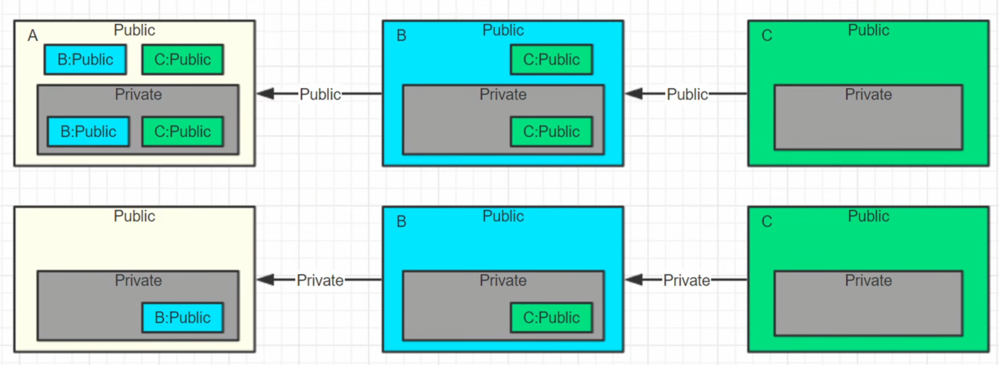
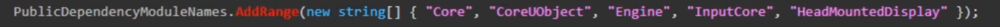
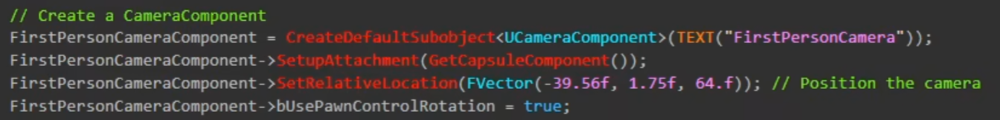

### [学习目标](https://b23.tv/BDz2DmJ)

> 1. TArray、TSet、TMap等各种容器
> 2. FString、FName、FText的操作互转
> 3. TSharedPtr、TSharedRef、TWeakPtr等各种智能指针
> 4. 有能力理解Delegate、TAttribute、TSubClassOf的机制和用法
> 5. 多看看设计模式，这样才能更好理解UE4代码的结构
> 6. 多线程的知识，这样才能用好FRunnable等多线程同步
> 7. 人脑展开宏..

### 源码阅读

#### 1. TArray、TSet、TMap等各种容器

在UE5/Source/Runtime/Core/Public/Containers/下，可以看到各种容器的定义，比如TArray.h、TSet.h、TMap.h等。

#### 2. FString、FName、FText的操作互转

在UE5/Source/Runtime/Core/Public/Internationalization/下，可以看到FString.h、FName.h、FText.h等。

#### 3. TSharedPtr、TSharedRef、TWeakPtr等各种智能指针

在UE5/Source/Runtime/Core/Public/Templates/下，可以看到TSharedPtr.h、TSharedRef.h、TWeakPtr.h等。

#### 4. Delegate、TAttribute、TSubClassOf的机制和用法

在UE5/Source/Runtime/Core/Public/Delegates/下，可以看到Delegate.h。

#### 5. 多看看设计模式，这样才能更好理解UE4代码的结构

#### 6. 多线程的知识，这样才能用好FRunnable等多线程同步

#### Gameplay部分

- Gameplay的C++编写
  - Actor的创建，组装Component，Beginplay，Tick，碰撞输入事件的绑定
  - 引擎Gameplay对象的继承组织使用
  - UObject自定义对象的组织管理（根据逻辑而定）
  - 引擎数据对象的使用，Config，DataTable
  - 功能模块的C++层次编写（UMG，AI，动画）注意有机结合

这部分代码在UE5/Source/Runtime/Engine/Classes/GameFrameWork下

### Module-UBT-CSharp

#### 思考: 为什么UE要用C# 来包含和库链接管理编译流程？

合适的头文件包含和库连接

大钊以前写的：
UE4支持众多平台，包括Windows，iOS，Android，因此UE4为了方便你配置各个平台的参数和编译选项，简化编译流程，UE4实现了自己的一套编译系统，否则我们就得接受各个平台再单独配置一套项目之苦。
简单来说，就是我们在VS里的运行，背后会运行UE4的一些命令行工具来完成编译工作。UE4的编译工具主要有两个，一个是UnrealBuildTool，一个是UnrealHeaderTool。
一般来说，UBT会先调用UHT，UHT会先负责解析一遍C++代码，生成相应的其他代码。然后开始调用平台特定的编译工具（VisualStudio, LLVM）来编译各个模块。最后启动Editor或者是Game。
UnrealBuildTool (UBT，C#): UE4的自定义工具来编译UE4的逐个模块并处理依赖等。我们编写的Target.cs，Build.cs都是为这个工具服务的。
UnrealHeaderTool (UHT): 解析生成工具，我们在代码里写的那些宏UCLASS等和`#include "*.generated.h"`都为UHT提供了信息来生成相应的C++反射代码。

回答出两个问题：include哪些.h文件，链接哪些库文件

- 优点: C# 足够易读，C# 足够灵活定制逻辑，C# 可以动态编译，方便搜集信息，C# 足够强大可以调用其他工具
- 缺点: C# 和C++ 混合经常搞得有些人糊涂，C++ 项目里混进C# 没有智能提示不够友好
- 解决: 常见的错误都是这两者报出的，记住常用语法就行了，有问题再查
- UBT用的是NMake build system

#### Build流程

- 学会链接模块，项目和插件可包含多个模块
- UBT调用UHT生成代码，然后调用MSBuild编译代码
- Build.cs是重点: ModuleRules.cs

当我们右键项目，选择Build的时候

1. UBT(CSharp写的)会收集Source目录下的cs(CSharp)文件，得到我们配置的模块信息
2. 调用UHT(C++写的)，他是个文本解析工具，不是编译工具，会生成头部信息中的"*.generated.h"，存放在Intermediate/Build/Win64/UE4Editor/Inc/Module名/目录下
3. 调用MSBuild编译代码，将Souce目录下的cpp文件和UHT生成的文件编译在一起，生成dll文件，存放在Binaries/Win64/UE4Editor/目录下（后面这部分是Ai生成，没有验证是否正确）

##### ModuleRules.cs 模块链接

- PublicDependencyModuleNames:
  - public链接的模块名称，最常用
  - 在自己的public和private中包含对方的public，扩充自己的public

- PrivateDependencyModuleNames:
  - private私有链接的模块名称只引用不暴露
  - 在private中包含对方的public，不扩充自己的public

- DynamicallyLoadedModuleNames:
  - 动态链接的模块名称，在运行时被ModuleManager加载，保证先编译

##### ModuleRules.cs 头文件include

- PublicIncludePaths:
  - public包含的路径
  - 定义自己向外暴露的public，默认"Public"和"Classes"

- PrivateIncludePaths:
  - private包含的路径
  - 定义自己的private，默认"Private"，给自己内部引用，一般用来定义private子目录。当然也可以路径包含private/sub，但这是一种方便方式

##### ModuleRules.cs 头文件include模块

- PublicIncludePathModuleNames:
  - public包含的模块名称，可以只写模块名称，不用写路径

- PrivateIncludePathModuleNames:
  - private包含的模块名称，可以只写模块名称，不用写路径

- 用途
  - 只包含对方模块的.h文件，比如模版
  - 更多的是动态链接，先包含头文件信息，之后加载

##### ModuleRules.cs 第三方库链接

- PublicAdditionalLibraries:
  - 引用的第三方lib路径
- PublicSystemLibrariePaths:
  - 引用的系统lib路径，其实也只是lib，只不过对于一些更"系统"底层的库用这个名字更友好一些
- PublicDelayLoadDLLs:
  - 延迟加载的DLL

##### ModuleRules.cs 其他常用

- PublicDefinitions + PrivateDefinitions:
  - 额外的其他C++宏定义
- Target
  - 得到当前的编译目标信息
  - Platform: 当前编译平台，Win64，Android等
  - Configuration: 当前编译配置，Debug，Release等

举个例子：
如果我们要包含一个文件D:\github\UnrealEnginelEngine\source\Runtime\Engine\classes\Components\BoxComponent.h
这当中，Engine就是模块的名字，所以我们可以在ModuleRules中写`PublicDependencyModuleNames.AddRange(new string[] { "Engine" });`，这样就可以直接包含这个模块了。
然后我们再去具体的.h文件，可以直接使用`#include "Components/BoxComponent.h"`，这部分就是路径

### 反射 UHT

- 理解.generated.h和gen.cpp的作用，(添加头文件后，记得重新generate一下，才能够生成相关的原数据和.generated.h文件)(好像是我写错了)
- 理解MODULENAME_API的含义，常见的犯错地方，这是用来做 DLL导出的
- 掌握使用这些宏的含义和用法（反射的重要标记）（ObjectMacros.h）
  - UCLASS
  - USTRUCT
  - UENUM
  - UPROPERTY
  - UFUNCTION
  - UDELEGATE
  - GENERATED_BODY()
- 清晰理解类型和对象的关系，类型是类的定义，对象是类的实例
- ClassReference和ObjectReference的区别
- 理解UCLASS*、UScriptStruct*、UFunction*、UProperty*、UField*的作用
- 掌握通过反射遍历对象属性、读取写入（常见）
- 掌握通过反射遍历对象函数并调用的方式（少一点）
- 通过对象找类型，通过类型找对象的方式
- 理解"对象用类型描述，类型也是对象"的概念

### CoreUObject

- GC: 理解对象之间的关系，标记清扫，有一些对象是Root，不会被清扫
  - 在用法上可以简单和C# 类比
  - 注意只有UPROPERTY标记的才参加GC！因为要根据UPROPERTY* 来分析引用链
  - 注意FMyStruct和UObject的混用， FGCObject::AddReferencedObjects()，这个函数是用来添加引用的
  - 自从用了UE4，我再也不new/delete了，因为GC会自动处理
- CDO: ClassDefaultObject，类的默认对象，用来初始化类的默认属性，理解类型和对象实例化，模版
  - 理解ClassDefaults作为模版的作用
  - 理解CDO在序列化中的意义作用
  - 通过UClass::GetDefaultObject()获取CDO信息
- Package: 理解对象的相互组织方式
  - 对象可以包含子对象
  - 序列化时，把一系列对象用一个对象抱起来，这个对象叫做包
  - Package也可以相互引用，根据对象相对路径

#### 套路1

- UHT的套路：**宏**
- 模块链接的套路: 几个常用属性.AddRange()

- Actor创建的套路:
  - ConstructorHelpers
  - CreateDefaultSubobject
  - SetRootComponent

- Gameplay继承的套路:
  - 尽量别在关卡蓝图里写逻辑
  - 想要结构良好，尽量遵循引擎结构，各司其职
  - GI、GM、GS、PC、Pawn、PS、继承一波带走
  - 遵循推荐结构，会发现后期扩展和支持联机，天然优势
- C++、BP交互的套路
  - UPROPERTY，UFUNCTION
  - C++定义基类写逻辑，蓝图继承配置可视化，这是一种推荐易扩展高性能的方式
  - 函数库是个好东西
- 事件绑定的套路:
  - DELEGATE, MULTICAST_DELEGATE, EVENT, DYNAMIC
  - Input: BindAction, BindAxis
  - EnhancedInput
  - Collision: Hit, Overlap, AddDynamic
  - Slate&UMG Event: SLATE_EVENT(FOnClicked, OnClicked)
  - FTimerManager

#### 引擎常用方法的套路

- Engine/Class/Kismet有好多库
- GameplayStatics很常用，可以访问Gameplay的很多对象
- UKismetSystemLibrary，系统目录等功能，LineTrace
- UKismetMathLibrary，数学库，常用的数学计算

### UE的垃圾回收机制

虚幻引擎的垃圾回收在根源上还是基于"标记-清除"的

垃圾回收函数 CollectGarbage

- 锁定
- 回收
- 解锁

锁定期间，其他线程的UObject的操作都不会正常工作，从而避免一边回收一边操作导致的各种问题

回收过程中对应函数可以看作两个步骤：标记和清除。
标记阶段为，全部标记为不可达，然后遍历对象并引用网络来标记可达对象。
清除阶段为，检查标记，没有标记的对象使用ConditionalBeginDestory请求删除

#### 虚幻引擎自身用了一些多线程和基于簇的方式来加速标记和回收过程

如何标记不可达？
  使用MarkObjectsAsUnreachable函数标记，借助FRawObjectIterator遍历所有Object，然后设置标记为Unreachable

如何遍历对象引用网络来标记可达呢？

1. 从哪里遍历？
   标记不可达算法以后，就把所有的"必然可达"对象收集到了数组里面，这些必然可达对象刚开始大部分是那些被添加到"根"的对象，这些对象一定不会被垃圾回收的，在收集的过程中，可达的对象会不断的被添加进来。
   然后遍历这些可达对象，搜索这些可达对象能够到达的其他对象，从而标记所有可达对象。
   有向图的遍历是非常复杂的，ue没有用dfs或者bfs，而是将二维的结构一维化来方便遍历。
2. 如何根据当前对象确定下一个对象？

#### 虚幻引擎的基于簇的垃圾回收（Cluster-Based Garbage Collection）

一种针对cook后资源的优化机制，旨在大幅提升内存回收效率。其核心思想是将关联紧密的对象（如材质、粒子系统及其子对象）划分为"簇"，通过直接回收整个簇而非逐个处理子对象，减少GC遍历时间。以下是具体实现细节和优势分析：

##### 1. 簇的定义与结构

- **簇（Cluster）**是一组以特定根对象（如`UMaterial`或`UParticleSystem`）为核心的对象集合。例如，一个`UMaterial`可能包含多个材质实例、着色器资源和纹理，这些子对象被统一管理为一个簇。
- **簇根（Cluster Root）**必须是`UMaterial`或`UParticleSystem`，因为它们在游戏中通常作为资源的核心入口，且子对象数量庞大（如材质可能关联数百个实例和依赖资源）。
- **簇的形成**：在资源cook阶段（如打包发布时），引擎通过反射系统生成对象引用的"记号流"（Token Stream），自动识别哪些对象属于同一簇。例如，材质的所有实例和依赖资源会被自动归为一个簇。

##### 2. 回收逻辑

- **标记阶段**：传统GC需要遍历所有对象的引用链，而基于簇的GC只需检查簇根是否可达。若簇根不可达（如未被任何关卡或蓝图引用），则整个簇直接标记为可回收。
- **清除阶段**：一次性销毁簇内所有对象，无需逐个调用`ConditionalFinishDestroy`，节省了大量时间。

##### 3. 与传统GC的对比

| **传统GC**                  | **基于簇的GC**              |
|-----------------------------|----------------------------|
| 逐个检查对象引用            | 直接回收整个簇              |
| 处理大量子对象时耗时        | 减少90%以上的遍历时间       |
| 内存碎片较多                | 整簇回收，碎片更少          |
| 适用于编辑器模式            | 仅适用于cook后资源          |

##### 4. 技术实现细节

- **反射系统**：引擎通过`UClass::AssembleReferenceTokenStream`生成对象引用的记号流，记录每个对象的依赖关系。例如，材质的子对象会被自动标记为同一簇。
- **簇根的判断**：只有`UMaterial`和`UParticleSystem`的`CanBeClusterRoot`函数返回`true`，其他类（如`UStaticMesh`）无法作为根，但可以在簇中。
