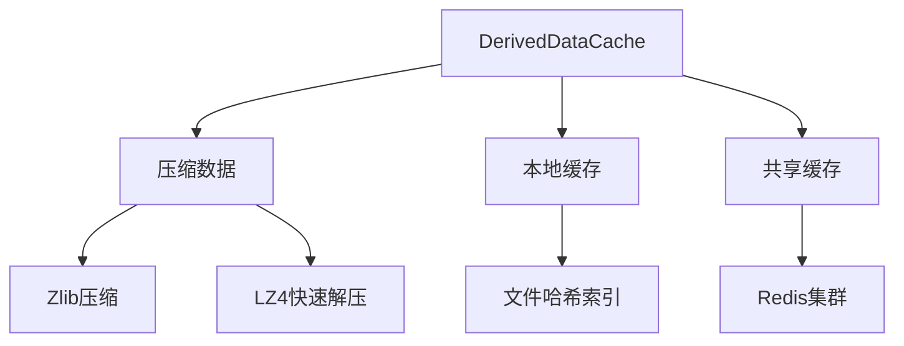

# Unreal Engine C++ 编译过程深度解析

## 目录结构体系

### 完整目录结构表

| 目录路径                  | 关键文件/子目录              | 功能描述                                                                 |
|---------------------------|-----------------------------|--------------------------------------------------------------------------|
| Binaries/                | [Platform]/[Project].exe   | 最终可执行文件及动态库                                                   |
| Build/                   | Build.version               | 构建版本记录文件                                                         |
| DerivedDataCache/        | *.ddc                       | 序列化资源缓存（纹理/材质/网格等）                                        |
| Intermediate/            |                             | 编译中间产物                                                             |
| ├── Build/               | *.obj, *.lib                | 编译器生成的中间文件                                                     |
| ├── Debug/               | *.pdb, *.sym                | 调试符号文件                                                             |
| ├── ProjectFiles/        | *.vcxproj, *.uproject       | IDE工程文件配置                                                          |
| ├── ShaderWorkingDir/    | HLSL源文件                   | 着色器编译临时文件                                                       |
| Saved/                   |                             | 运行时生成数据                                                           |
| ├── Config/              | *.ini                       | 项目配置持久化文件                                                       |
| ├── Logs/                | *.log                       | 运行日志文件                                                             |
| Source/                 |                             | 项目源代码                                                               |
| └── [ProjectName]/       |                             | 项目专属代码                                                             |
|    ├── Classes/          | *.h                         | 过时的UObject类声明（兼容遗留项目）                                      |
|    ├── Config/           | Default*.ini                | 模块默认配置                                                             |
|    ├── Public/           | *.generated.h               | UHT生成的反射头文件                                                      |
|    └── Private/          | *.cpp                       | 具体实现代码                                                             |

### 关键文件功能说明

1. **.uproject文件**  
   - 结构：JSON格式
   - 作用：定义模块依赖、插件配置、目标平台

   ```json
   {
     "Modules": [
       {
         "Name": "MyModule",
         "Type": "Runtime",
         "LoadingPhase": "Default"
       }
     ]
   }
   ```

2. **.target.cs文件**  
   - 位置：Source目录
   - 功能：定义构建目标配置
  
   ```csharp
   public class MyProjectTarget : TargetRules {
       public MyProjectTarget(TargetInfo Target) {
           Type = TargetType.Game;
           DefaultBuildSettings = BuildSettingsVersion.V2;
           ExtraModuleNames.Add("MyProject");
       }
   }
   ```

3. **.build.cs文件**  
   - 作用：模块构建规则定义

   ```csharp
   public class MyModule : ModuleRules {
       public MyModule(ReadOnlyTargetRules Target) {
           PublicDependencyModuleNames.AddRange(new string[] { 
               "Core", "Engine" 
           });
           PrivateIncludePaths.Add("Private/Path");
       }
   }
   ```

## 一、核心编译阶段与产物

### 1. 预编译阶段（UHT处理）

- **生成文件**：
  - `*.generated.h`
  - `*.gen.cpp`
- **目录位置**：`Source/[ProjectName]/Public/`
- **核心机制**：
  - UHT（Unreal Header Tool）通过解析`UCLASS`/`UFUNCTION`等宏标记
  - 生成类型元数据（Class Metadata）
  - 创建反射系统基础设施

### 2. 编译预处理阶段

- **生成文件**：
  - `*.cpp.response` 
  - `*.module.order`
- **目录位置**：`Intermediate/ProjectFiles/`
- **作用**：
  - 管理编译单元依赖关系
  - 优化编译并行度
  - 生成PCH预编译头配置

### 3. UBT编译协调阶段

- **生成文件**：
  - `*.vcxproj`/`*.csproj`
  - `*.uproject`
  - `Target.txt`
- **目录位置**：`Intermediate/ProjectFiles/`
- **核心功能**：
  - 解析`.Target.cs`构建规则
  - 生成跨平台编译指令
  - 协调多模块编译顺序
  - 实现HotReload机制

### 4. 编译器处理阶段

- **生成文件**：
  - `*.obj` (Windows)
  - `*.o` (Mac/Linux)
  - `*.lib`/`*.a`
- **目录位置**：`Intermediate/Build/`
- **平台差异**：
  - Windows：生成`.pdb`调试数据库
  - Mac：生成`.dSYM`符号文件
  - Linux：生成`.debug`节区

### 5. 链接器合成阶段

- **生成文件**：
  - `[ProjectName].dll`/`lib[ProjectName].so`
  - `[ProjectName].exe`
  - `*.map` 链接映射表
- **目录位置**：`Binaries/[Platform]/`
- **关键过程**：
  - 合并代码段与数据段
  - 处理重定位表
  - 注入引擎初始化代码

## 二、核心工具链解析

### 1. UHT反射实现机制

```cpp
// UHT解析示例
UCLASS(BlueprintType)
class UMyObject : public UObject {
    GENERATED_BODY()
    UPROPERTY(EditAnywhere)
    FString ObjectName;
};
```

- **代码生成流程**：

  1. 扫描所有`#include "*.generated.h"`头文件
  2. 提取`UCLASS`/`UFUNCTION`元数据
  3. 生成`ClassInfo.gen.cpp`反射描述
  4. 创建`TypeInfo`注册到UObject系统

- **序列化实现**：
  - 生成`Serialize`重写方法
  - 构建属性内存偏移表
  - 支持版本化序列化（`FArchive`）

### 2. Shader编译系统

- **编译管线**：

  ```mermaid
  graph TD
    HLSL-->[ShaderCompiler]GLSL/SPIR-V
    HLSL-->[DXC]DXIL
    GLSL-->[SPIRV-Cross]MSL
  ```

- **产物结构**：
  - `ShaderCache.ushaderbytecode`
  - `PSO(PipelineStateObject).bin`
- **调试支持**：
  - 保留中间`HLSL`源码
  - 生成`ShaderSymbols`映射表

## 三、高级编译机制

### 1. DDC缓存体系

- **目录结构**：

  ```.cpp
  DerivedDataCache/
  ├── Compressed.ddc
  ├── Local.ddc
  └── Shared.ddc
  ```

- **核心文件**：
  - `*.upipelinecache`（着色器管线缓存）
  - `*.ubulkdata`（大资源序列化数据）
  - `*.uddcinfo`（缓存元数据）
- **加速原理**：
  - 基于内容哈希的缓存键生成
  - 支持本地/网络/云分布式缓存
  - 增量更新机制

### 2. Cook过程解析

- **生成结构**：

  ```mermaid
  graph LR
    RawAssets-->|平台适配|ProcessedAssets
    ProcessedAssets-->|序列化|Cooked/[Platform]
  ```

- **关键文件**：
  - `AssetRegistry.bin`（资源注册表）
  - `GlobalShaderCache*.bin`（全局着色器）
  - `*.uasset`（序列化资源）
  - `*.uexp`（附加资源数据）

### 3. 运行时模块加载

- **文件结构**：
  - `[ModuleName].modules`（模块描述文件）
  - `[ProjectName]/Plugins/`（插件模块）
- **加载流程**：
  1. 解析`.uproject`模块依赖
  2. 加载`.dll/.so`动态库
  3. 执行`StartupModule()`初始化
  4. 注册到引擎模块系统

## 四、调试与优化

### 调试符号管理

| 平台    | 符号文件          | 路径配置                  |
|---------|-------------------|---------------------------|
| Windows | `.pdb`           | `Binaries/[Platform]/PDB` |
| Mac     | `.dSYM`          | `Binaries/MacOS`          |
| Linux   | `.debug`         | `Binaries/Linux`          |
| Android | `.sym.so`        | `Saved/Symbols`           |

## 五、UHT反射系统深度解析

### 1. 反射元数据结构

```cpp
// 生成的反射数据结构示例
struct FClassMetaData {
    FName ClassName;
    TArray<FPropertyMetaData> Properties;
    TArray<FFunctionMetaData> Functions;
    TMap<FName, FString> MetaSpecifiers;
};

// 内存布局示例
+-------------------+
|   UClass*         |--> 反射类型描述
+-------------------+
|   FProperty*      |--> 属性链表
+-------------------+
|   UFunction*      |--> 函数集合
+-------------------+
```

### 2. 反射代码生成流程

1. **宏展开阶段**：
   - 解析`UCLASS()`宏参数
   - 生成`ClassGeneratedBinding.cpp`
2. **模板实例化**：
   - 创建`TClassMetaData<T>`模板实例
   - 生成`ClassInfo.gen.cpp`
3. **注册阶段**：
   - 调用`RegisterClassInfo()`函数
   - 构建UObject继承树

### 3. 序列化协议实现

- **版本控制机制**：

  ```cpp
  FArchive& operator<<(FArchive& Ar, FObjectTag& Tag) {
      Ar << Tag.Version;
      if (Tag.Version >= 5) {
          Ar << Tag.OptionalData;
      }
      return Ar;
  }
  ```

- **内存对齐规则**：
  - 4字节对齐（32位系统）
  - 8字节对齐（64位系统）
  - 使用`MS_ALIGN`宏控制

## 六、编译产物全览表

### 1. 核心编译产物

| 文件类型              | 生成路径                  | 作用周期         |
|-----------------------|---------------------------|------------------|
| `.generated.h`        | Source/Public/            | 开发期间         |
| `.obj/.o`             | Intermediate/Build/       | 单次编译有效     |
| `.dll/.so`            | Binaries/[Platform]/      | 运行时加载       |
| `.ddc`                | DerivedDataCache/         | 多项目共享       |

### 2. 调试辅助文件

| 文件类型              | 平台        | 分析工具         |
|-----------------------|-------------|------------------|
| `.pdb`                | Windows     | Visual Studio     |
| `.dSYM`               | Mac         | LLDB             |
| `.debug`              | Linux       | GDB              |
| `.trace.csv`          | 全平台      | Unreal Insights  |

### 3. 缓存系统文件



## 七、UHT反射系统深度解析（补充）

### 4. 反射系统内存管理

```cpp
// 对象实例化流程
UObject* CreateObjectInstance() {
    UClass* Class = FindObject<UClass>(ANY_PACKAGE, TEXT("MyClass"));
    return NewObject<UObject>(GetTransientPackage(), Class);
}

// 内存分配策略：
// 使用TMemStackAllocator进行快速内存分配
// 采用Slab分配器管理小对象（<256B）
// 大对象直接使用系统malloc
```

### 5. 跨模块反射支持


## 八、编译优化验证指标

### 编译性能基准测试表

| 指标类型          | 测量方法                  | 合格标准       | 优化手段         |
|-------------------|-------------------------|---------------|------------------|
| 完整编译时间      | 清理后首次编译          | <30分钟       | 启用DDC共享缓存  |
| 增量编译时间      | 单个cpp文件修改         | <60秒         | 调整PCH包含策略  |
| 着色器编译时间    | 修改基础材质            | <5分钟        | 使用ShaderPipeline缓存 |
| 内存占用峰值      | 编译期间监控            | <16GB         | 限制并行编译任务数 |
