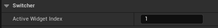

## 通用属性

### Slot 插槽

UMG通过锚点与校准点来进行适配，首先得先了解这背后的原理。

**[锚点(Anchors)](https://dev.epicgames.com/documentation/en-us/unreal-engine/umg-anchors-in-unreal-engine-ui?application_version=5.2)** 是用来定义UI控件在**画布面板**上的预期位置，并在不同屏幕尺寸下维持这一位置的，根据不同分辨率的屏幕，保持相对于锚点的位置不变，从而保证这个UI控件不会超出屏幕，或者位置发生严重偏移。

**校准点(Alignment)** 坐标代表这个点在本控件上的位置，(0,0)代表在左上角，(1,1)代表在右下角。如果是(0,0)，就意味着用左上角的点和锚点做位移判断。

锚点的选择可以总结成三种：

1. 九点适配（以中心点为例）  
     
     
   观察Anchors下可以设置的部分，发现我们修改Position和Size

   - Position是校准点与锚点的XY距离
   - Size是控件XY尺寸

2. 水平/垂直拉伸（以水平顶部为例）  
     
     
   这个就是将组件分成两个部分，分别对其使用Offset和Position的设置，即：左半边是对左上角的Anchor使用Offset Left确定位置，Position Y确定上下位置  
   

3. 全局拉伸  
     
     
   参考水平、垂直的方式，全局就是将锚点分成四个部分，分别对其使用Offset和Position的设置

值得注意的是，这些锚点的都是相对于该组件的父组件设置的，而不是统一的以根节点作为参考，并且，我们可以手动设置每一个节点锚点的位置、形式。（点击锚点的叶瓣）

**尺寸适配内容(Size To Content)** 开启后，其会检索自身的子节点或其他资源，自动调整尺寸。聊天框的文字适配就可以用这个功能来做。

**ZOrder** UMG在渲染的时候是按照Panel中图层**从下至上**的层级来渲染效果的，但是对Canvas Panel除外。Canvas Panel的所有子集都是平行的关系，因此有些时候会出现上方图层的渲染层级高于下方的图层。这个时候可以调整ZOrder来强行调整渲染层级，但是要尽量少用，因为**其会占用额外的渲染开销**。另外，Z轴顺序调整局限于该控件的父集内部，不能叠加。

### Content

Horizontal Alignment / Vertical Alignment: 水平/垂直对齐  
Content Color and Opacity: 里面内容的颜色和透明度  
Padding: 其本身与其包含的内容之间的填充距离, The Padding styling option refers to the border created around aspects of the Widget.

### Apperance

**Brush** 图片刷子，类名是FSlateBrush。  
  
**Tint** 影响最后绘制出来的图片的颜色  
**Draw As** 分为三种情况  

- Draw As image
  - 保持不变
- Draw As Box
  - 假设Margin全部设为0.2，则该Border会根据图片的像素，计算出上下左右20%的比例，设其为固定内容，保持不变，避免像Draw As image那样被拉伸
  - 注意是拉伸的时候保持边框不变，里面的内容仍然存在，且会被拉伸
- Draw As Border
  - 同Box，但是中间的内容会变成空的，只保留设定的边框内容
  - 保留的只有边框内容，所以会很难给出准确的值，要么做图片的时候就不做里面的内容，要么就用Draw As 同Box
- Draw As Rounded Box
  - 绘制圆形Box
  - 
    - Corner Radii: 圆角半径，Rounding Type为Fixed Radius生效，设置四个角的圆的半径
    - Outline: 轮廓颜色，设置四个圆角的边框颜色
    - Width: 轮廓宽度
    - Rounding Type
      - Fixed Radius 固定尺寸
      - Half Height Radius 半径固定为一半高度

>   
> Draw As 原理示意图

> 九宫格原理：中间部分会拉伸，四周保持原样  
> 

Color and Opacity: 该处染色对整个控件进行染色，即所有状态的资源都会叠加上这个颜色

**Font** 字体  
  
> UMG制作时默认dpi为96像素/英寸，psd默认dpi是72像素/英寸。  
> 在GUI设计时将dpi设为96，或者将72dpi下字体的字号乘以0.75，都能还原效果图中的效果。  
Justification: 只能调整垂直方向的对齐方式，是因为UE的对齐逻辑基本都靠控件与Panel之间的相对位置来进行，因此此处若要调整竖直方向的对齐方式可以在外嵌套sizebox

### Warpping

  
这里提供了两种文本自动换行的方法，两者不能同时生效。

1. 根据父节点的尺寸自动换行
2. 当单行文本内容达到某一像素长度时进行换行（设为0代表不自动换行）

**注意：** 如果需要文本能够在打断英文单词来进行换行，则需要额外勾选 Allow Per Character Wrapping，否则一个超长单词是不会被打断来进行换行的

另外，Appearance下的AutoWrapText一般是不勾上的。

### Interaction

  
勾选Is Focusable后，这个控件在收到点击事件时，就会打断其他所有正在进行的操作。

强制打断的界面入口可以勾选，来打断移动、攻击等操作；非强制打断的吃药、切换武器操作入口则不能勾选。

### Behavior

  
Tool Tip Text 悬停提示，鼠标悬停的时候显示的提示文字内容

Visibility 可见性，此处可以控制游戏中的显示效果，但不影响在UMG制作时的显示与隐藏。

1. Visible 可见并接受交互事件
2. Collapsed 不可见且不占用任何体积
3. Hidden 不可见但占用体积，不接收交互事件
4. Hit test invisible 可见，且他和他的子节点都不接受点击事件
5. Set hit test visible 可见，且他自身不接受点击事件，不影响子节点

由于visible状态可以接受交互事件，因此在收到交互事件的时候会遍历目前所有visible状态的UI控件，因此可见但不可交互的控件的visibility调成Set hit test visible会提高计算速度。

有许多控件的默认状态就是visible，例如image，因此在确认控件不接收交互事件时可以设为set hit test invisible可以减少不必要的开销。

Tool Tip Widget: Tooltip widget to show when the user hovers over the widget with the mouse

### [Clipping](https://dev.epicgames.com/documentation/en-us/unreal-engine/clipping-for-umg-widgets-in-unreal-engine?application_version=5.5)

1. **继承（Inherit）**  
  该控件不裁剪子项，并且将遵循从父控件传入的任何裁剪/剔除。

2. **裁剪至边界（Clip to Bounds）**  
  该控件裁剪控件边界外的内容。它将边界与先前的裁剪区域相交。

3. **裁剪至边界 - 无相交（Clip to Bounds - Without Intersecting）**  
  此控件裁剪至其边界。它不与现有裁剪几何体相交，而是推送新的裁剪状态。这实际上会允许它在要裁剪的层级的边界之外渲染。这并不会允许你忽略设置为 裁剪至边界 - 总是（Clip to Bounds - Always） 的裁剪区域。

4. **裁剪至边界 - 总是（Clip to Bounds - Always）**  
  此控件裁剪至其边界。它会将这些边界与之前的裁剪区域相交。此裁剪区域无法忽略，它将总是裁剪子项。这很适合UI中的硬屏障，因为你绝不会希望其中的动画或其他效果突破此区域。

5. **按需（On Demand）**  
  此控件会在其所需大小超过为该控件提供的已分配几何体时裁剪至其边界。如果发生该情况，它的作用将类似于 裁剪至边界（Clip to Bounds）。此模式主要为 文本（Text） 添加，它常常放置到最终会调整大小而无法支持文本长度的容器中。所以，无需标记可能包含带[YES]的文本的每个容器，从而几乎不会导致批处理，添加此模式是为了根据需要动态调整裁剪。并非每个容器都设为 按需（On Demand），因为并非每个面板返回的所需大小都与它计划渲染所用的大小匹配。

### Render Transform

  
可以设置平移、缩放、倾斜和旋转，也可以调整对应的Pivot点  

## 组件介绍

UMG中常用的控件类型有四种  
  
  

### [Border](https://www.youtube.com/watch?v=Ho0G26VxmII)

只能包含一个子控件  
A Border is a container widget that can contain one child widget, providing an opportunity to surround it with a back ground image and adjustable padding.

### Button

按钮有Normal/Hovvered/Pressed/Disabled，开发时至少为前三种设置资源  
接受交互事件的形式：  
  
如果在一个Scrollbox里面嵌套了Button组件，在手机上接收Button的点击事件时会屏蔽掉Scrollbox的滚动事件，导致Scrollbox无法滑动。如果吧Touch Method改为Precise tap则会精准区分点击与滚动事件。因此Scrollbox里面Button需要修改该项设置，以免照成误操作或者无法滚动的情况。

### CheckBox

选择框可以添加一个子节点

### Image

Image不能添加子节点，且原始资源就是一个白色块，所以所有的纯色块资源都可以通过染色实现。  
**注意：** Image不仅仅可以引用图片资源，也可以添加材质资源，可以通过材质来制作粒子、模型、特效等效果

### NameSlot

可以为自定义UI添加新的组件，用户创建的UI，在成为其他UI的子控件的时候，默认情况下无法在该UI下添加新的子控件的，但是如果在创建的时候添加NameSlot，就能够实现在成为其他UI子控件时，也可以拥有子控件。

### Progress Bar

进度条不能添加子节点  

### Radial Slider

环形滑块  

### Rich Text Block

富文本可以在一个文本框内显示不同的字体格式和图片文字，为了实现这一效果，首先要创建一个字体格式表格。  
  
  
  
然后使用时参考以下格式:

- 文本内容
  - `<字体格式名>文本内容</>`
- 文本类型
  - 将需要的Datatable填入TextStyleSet

### Slider

滑块不能添加子节点  
**Step Size (步长)** 用于控制滑块控件相邻两档之间的最小间距  
**Bar Thickness** 调整进度条宽度

### Text

普通的文本框

### Canvas Panel

画布面板是一种基础的面板，允许在任意位置布局、固定控件，并将这些控件与画布的其他子项按Z轴排序，适合手动布局，但是很难对齐，因此一般有较强的栅格系统的排版不建议采用。

### Grid Panel

  
自己创建一套网格系统，并让子控件在该网格内进行布局，可以设置对应的高度比例

### Horizontal Box

存放进去的子组件会水平排布

### Overlay

允许组件堆在另一个组件上，经常和Canvas Panel对比，调整层级时比Canvas Panel节约性能？

### Safe Zone

安全区控件的子节点会避开全面屏幕的安全区来进行适配，也可以针对某一个方向设置是否生效。  
避免设计被一些手机摄像头、灵动岛遮挡

### Scale Box

只能包含一个子控件  
放入Image后，可以保证Image比例进行缩放  
允许以所需要的大小来放置内容，并将其缩放来满足放置在此框分配区域上的约束。利用此方法可缩放背景图像来填充区域，不会在不同高宽比下出现扭曲；也可以自动将一些文本与区域匹配  
  
> Fill：填充满整个Scale Box，并且始终保持比例缩放，不会被裁减  
> Scale to Fill：填充满整个Scale Box，并且始终保持比例缩放。会被裁减  
> Scale to Fit X：只充满横向（X轴），保持比例，Y轴可以被裁减  
> Scale to Fit Y：只充满纵向（Y轴），保持比例，X轴可以被裁减  
> User Specified Scale：自定义缩放比例，而不是根据Scale Box的尺寸缩放，Scale Box大小缩放在此模式下不影响图片。

### Scroll Box

可以使内容过多时在限定范围内滚动

### Size Box

指定一个特定的尺寸，只能放一个子组件  
**Width Override**: 无视内容的大小，SizeBox宽度为此值（相当于覆盖图片的size）  
**Height Override**: 无视内容的大小，SizeBox高度为此值（相当于覆盖图片的size）  
**Min Desired Width**: 最小宽度  
**Min Desired Height**: 最小高度  
**Max Desired Width**: 最大宽度  
**Max Desired Height**: 最大高度  
**Max Aspect Ratio**: Size Box的X/Y比例(长宽比)

### Stack Box

让子组件自动按水平和垂直方向排布

### Uniform Grid Panel

可以设置子控件的所在行和列，元素大小完全相同。可设置子控件的填充格式，并设置所在行列，格子会自动增加，并且格子大小完全一致。  

### Vertical Box

垂直布局

### Widget Switcher

可以通过该组件在一个地方展示不同的UI  
  
选择要展示的UI，序号是按照塞入的默认顺序排布的

### Wrap BoX

流布局，子控件可以按照Wrap Box的大小自动换行  
> **Inner Slot Padding**：设置子控件横向纵向的留白，可以实现每个子控件之间的间距都是相同的。注意的是在最左侧的子控件是靠边的。  
> **Wrap Box.Wrap Width**：设置强制换行的宽度，而不是根据Wrap Box 的实际宽度。需要勾选 Wrap Box.Explicit Wrap Width 属性。  
> **Wrap Width**：设置每行长度超过一定范围时，元素就显示在下一行，此选项与 Explicit Wrap Width 配合使用。  
> **Explicit Wrap Width** 选项的勾选，就可以设置每行的宽度值，超过宽度值后才会换行，不超过宽度值无论 Wrap Box 的大小是多少都不会换行（系统默认是子控件的排列长度到达 Wrap Box 边界才会进行换行）。  
> **Wrap Box.Fill Empty Space**：如果当前子控件是所在行最后一个控件，并且后面有剩余的控件，则自动充满。  
> **Fill Span When Less Than**：当 Wrap Box 子控件排列中，无论排列在第几行是不是最后一个，只要一行中总可用空间（是可用空间）小于此值，则自动填充满整行，注意是整行。

## List

### List View

[List view in unreal engine](https://medium.com/@TechArtCorner/list-view-in-unreal-engine-umg-blueprint-7a08b7987820)

- List View: 显示列表的Widget
- Entry(词条；条目) Widget: 列表中的每个列表条目的Widget
- Entry Data: 每个列表条目的数据
- Data Structure: 数据结构
